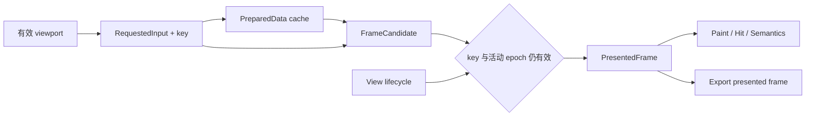

# 第六轮：核心模型审查与第五轮整改验收

日期：2026-09-23。基线：`a31da5a8 fix(charts): unify lifecycle axis and motion state`。
参照 [第五轮报告](../acceptance-30c29929/report.zh-CN.md) 和 [整改说明](../acceptance-30c29929/remediation.md)。

## 1. 结论与本轮交付重点

**第五轮原始复现均通过；核心模型尚未整体统一，暂不建议按完整 Chart Runtime 契约验收。**
这轮有一处明确的结构进步：单个 Cartesian 场景内，每根轴现在编译一次，并把同一个 scale 结果交给 series、ticks、annotation 和 custom renderer。原来的空 schema 分叉已经消除，应该保留这个实现方向。

其余关键问题已经不能充分解释为局部漏写：

- 数据已准备、几何已计算、画面已呈现，仍然被当成近似等价的状态；
- 原生 lifecycle 的 prepare 已经激活资源和时钟，而补偿失败没有终止/隔离状态；
- Host 认可的 viewport、手势 preview、联动覆盖和像素 pan 仍混在一组字段中；
- 联动服务再次从轴 metadata 推导坐标状态，Geo 没有进入同一协议。

本轮用 **5 个失败的原生性质测试**确认了 **4 类行为缺陷（2 个 P1、2 个 P2）**。它们是模型问题的证据；整改目标不应仅是让这五个断言转绿。后文给出事实所有者、提交边界、目标模型和实施顺序。

建议保留 Rust/Rhai 分工、NativeChartData、现有语义/绘制数据分离和单场景轴编译；集中调整 **呈现帧提交、生命周期与活动时间、typed viewport 联动** 三处边界。没有证据支持推翻整个项目、换 UI 技术栈或立即拆成更多 crate。

本轮只新增审计代码、文字和日志。产品实现、已有 UI 文档归并及参考图删除均未改动，也未添加图片。

## 2. 审查方法：怎样判断“真正统一”

对每一个核心事实，要求能回答五个问题：

1. 谁拥有最终决定权，谁可以修改它？
2. 哪个对象是权威结果，其他对象是输入、候选、缓存还是只读投影？
3. 它的版本包含哪些依赖，什么条件下失效？
4. 什么时候提交，失败、取消、重试和恢复后是什么状态？
5. 哪个性质测试能够证明上述关系，而不仅是证明一个正例？

多个版本可以同时存在：后台准备新数据时保留旧帧是合理且必要的。问题在于它们没有明确区分，或消费者用一个阶段的字段推断另一个阶段已经完成。代码复用、字段集中和文件拆分都不能单独证明模型统一。

证据分类：**R** 为独立复现，**S** 为源码确认，**D** 为设计判断/建议，**G** 为尚未完成的验证。

## 3. 核心模型现状

| 模型 | 当前权威与消费者 | 判定 | 下一步 |
|---|---|---|---|
| 原始数据 | NativeChartData 的不可变 snapshot、source identity、revision；Rust producer 原子发布 | **基本成立** | 保留；将 identity/revision 纳入完整帧依赖，不只读 revision 数字 |
| 语义数据与绘制采样 | ChartPreparedData 分开保存 semantic dataset 与 draw dataset；坐标域读取语义数据 | **基本成立** | 保留；prepared 明确作为可复用中间产物，不代表已呈现 |
| 单场景坐标事实 | horizontal/vertical plan map 缓存 scale/domain；series、ticks、annotation、custom context 引用缓存 | **本轮已实质统一** | 保留；把计划纳入后续 frame/viewport 服务，避免场景外重新解释 |
| 呈现帧 | config、prepared、scene、previous_scene、zoom/pan、任务 generation 分别修改；scene 只公开 data revision | **未统一** | 建立完整 FrameKey 与原子 PresentedFrame，见 C01 |
| 手势与受控 viewport | proposal 有 revision 和输入 generation，但 committed/preview/linked 状态仍共享 local zoom/pan | **局部统一** | 明确状态机及有效 viewport 的唯一推导入口；停止靠 revision 数值猜协议 |
| 联动坐标 | ChartLinkedViewport 只有 x/y 区间；从第一组 Cartesian axis metadata 重算 | **未统一** | typed domain binding 和坐标类型能力检查，见 C04 |
| view 生命周期 | 原生 prepare＋脚本事务＋反向 hook 补偿；公开 state 在成功后切换 | **单次失败路径改善，异常闭环不完整** | 定义 compensation failure 的故障态与资源隔离，见 C02 |
| 动画时间 | RuntimeClock 是共同墙钟，MotionRuntime 与 Chart 仍分别维护暂停偏移；Chart 在 native prepare 恢复计时 | **未形成共同活动时间** | view 拥有已提交的活动时间，见 C03 |
| 绘制/命中/语义/导出 | 已共用 mark geometry、role、DatumRef 与 selection helper；export 可重新编译 terminal scene | **共同场景基础成立，发布快照边界未完整** | 明确“导出当前帧”和“按请求编译新帧”；所有消费者使用相同帧事实 |

**S：** `ChartPrimitiveHandler::render` 仍承担 parse/config 更新、link 注册和潜在任务启动。现有相等判断避免了前几轮循环，但输入提交与纯绘制边界仍混合。不能再次把 render 次数当成输入提交、确认或业务版本。

现有 primitive `update(previous,next)` 可用于记录新 prop epoch，但它没有 App/theme 上下文；实现时可以暂存显式更新，再在具有 App 的阶段应用一次，或审慎调整 hook。不要假设现有签名已经提供全部能力。

## 4. 第五轮验收与常规验证

| 检查 | 结果 |
|---|---|
| 原单次 lifecycle hook 失败 | 全部同伴被补偿，状态一致，retry=Ok(true) |
| 原空 schema 轴与 annotation | 同一 X=10 都为 x=461.5 |
| 原正常 suspend/resume 动画 | 恢复时旧位置仍可命中，终点不提前命中 |
| 第五轮原始 native 附件 | **3/3 通过** |
| Workspace 全目标、全 feature、locked/offline | **561 通过** |
| 原生独立包 | **87 通过** |
| performance 默认检查 | **4 通过，3 ignored** |
| fmt / 严格 Clippy | **通过** |
| 本轮核心 native 探针 | **3 通过、5 失败**；3 个通过项为原用例对照 |
| 100k v2 debug 单样本 | 通过，包含数据 revision 断言，stream 后 Rhai operations=0 |

单个 debug 样本不构成性能认证。数据 revision 断言也不能验证 viewport/resize 等数据未变化的帧是否正确提交，这个观测能力本身需要随帧模型补齐。

证据：[原 native 重跑](evidence/previous-native.log)、[原 public 重跑](evidence/previous-public.log)、[核心探针](evidence/core-native.log)。没有将已通过的旧复现重新算作未修复。

## 5. C01 · P1：缺少有效呈现帧模型，恢复时会持续保留旧数据或已取消 preview

位置：[chart/primitive.rs](../../../../crates/gpui-rhai/src/chart/primitive.rs) `suspend`（369）、`resume`（395）、`start_prepare`（546）、`rebuild_scene_with_motion`（590）。

### 5.1 prepared revision 被误当成 presented revision

**R：** 使用固定 GPUI 的公开测试 executor `tick()` 一次运行一个任务，确定性停在：

```text
data source revision = 2
prepared revision    = 2
revision 2 geometry  = 已计算，前台安装尚未执行
presented scene      = revision 1
```

此时 suspend 取消待安装的 layout；resume 后：

```text
old=1, wanted=2, before_suspend=1, after_resume=1, layouts=2
```

恢复逻辑看到 prepared.revision==source.revision，便跳过重建。旧帧没有 pending job 推进到 revision 2。数据更新没有丢，丢的是“这个数据版本尚未成功呈现”的事实。

测试没有故意让 renderer 失败，没有 sleep、私有字段写入或产品测试 hook；layout 是纯计算。在 suspend 前还显式断言公开 scene revision 仍是旧值，确保命中了真实安装边界。

### 5.2 data revision 没变化也会失效

**R：** Host 始终控制 zoom=1。Started 手势将 native preview 改成 zoom=0.5，完成该 preview 的实际布局，但尚未 Ended/ack。随后 suspend/resume：

```text
committed marker center x = 116.8
preview marker center x   = 165.4
resume 后 committed 位置无新命中，preview 位置仍可命中
layout count 仍为 2
```

suspend 把 `self.zoom` 还原成 config.zoom，却没有同时使 preview scene 失效；resume 仅检查 data revision，于是在没有后续触发重建时，控制值与可见几何持续分离。只改成检查 scene.revision 也不够，因为这个用例的数据 revision 根本没变。

**结构根因：** 请求、数据准备、几何候选、实际呈现缺少各自完整版本及提交关系。此前为避免无变化 resume 重启动画，引入了 data-revision-only 快捷判断；它修复了一个路径，同时把其他失效原因压掉了。这是本轮最明确的结构性证据。

**整改边界：** 以完整渲染输入生成 FrameKey；prepared 只证明数据阶段完成。取消 layout 后，frame 状态必须回到 Missing/Pending，resume 恢复尚未完成的必要阶段。取消 preview 必须重新计算有效 viewport 并使对应 FrameKey 变化，或恢复已缓存的 committed frame。

允许继续显示内部一致的旧帧等待新候选，但必须明确它是旧 PresentedFrame，且有待处理的新请求/错误；不能用 prepared 的新字段把旧帧标为已经完成。

## 6. C02 · P1：补偿失败没有故障态，普通 Suspended 仍可能包含活动实例

位置：[app.rs](../../../../crates/gpui-rhai/src/app.rs) `prepare_native_resume`、`suspend_view`、`native_lifecycle_error`；[primitive.rs](../../../../crates/gpui-rhai/src/primitive.rs) lifecycle hooks。

**R：** A/B/C 都已正常 suspend。恢复时 A 成功、B 失败；补偿过程中 A.suspend 又失败，其他清理成功：

```text
resume() = Err(... resume failed ... compensation failed ...)
view.state() = Suspended
native active flags = [true, false, false]
```

这是两次受控、被产品 guard 捕获的一次性 panic。结论不是“任意扩展 panic 必须自动恢复”，而是当前返回的普通 Suspended 状态已不能代表其宣称的 quiescent 资源边界。

**结构根因：** 当前“事务”是调用反向 hook 的补偿协议。补偿也可能失败，但实现仅将它拼入错误字符串，仍保留原来的正常 state。缺少不可恢复失败的隔离/终止分支。

**整改边界：** 明确补偿失败后的 Faulted 或终止策略；通过独立资源 scope 尽最大可能清理，阻止输入、候选安装和常规恢复。Host 必须能结构化判断“可重试的 Suspended”和“需要重建/处置的故障态”。允许设计为处置整 view，但不能把混合状态继续当作安全挂起。

不要求回滚任意外部副作用，也不假设能控制违反资源归属规则的扩展。需要保证框架自己的状态诚实，并处理其已登记资源。panic containment、补偿和事务原子性是不同保证，文档也应区分。

## 7. C03 · P2：失败的 resume prepare 仍消耗图表动画时间

位置：[chart/primitive.rs](../../../../crates/gpui-rhai/src/chart/primitive.rs) `resume` 的时间偏移及 `current_scene_sample`；[app.rs](../../../../crates/gpui-rhai/src/app.rs) native prepare/脚本提交顺序。

**R：** 对正常冻结用例增加一个排序在 Chart 之后的测试 primitive。它在 resume prepare 中推进 ManualRuntimeClock 60 秒，然后失败。公开 view 没有成功变为 Active，补偿也成功回到 Suspended；第二次 resume 成功后：

```text
frozen point click: 没有新增命中
terminal point click: 成功
```

普通 suspend/resume 对照仍通过。本轮新增的是失败准备阶段，不是墙钟计时误差；测试没有真的等待 60 秒。

**结构根因：** Chart 在 native prepare 中就将自己的 activity 设为 Active，并以墙钟修正 `transition_started`。后面的 prepare 失败之前流逝的时间，被下一次 Chart.suspend 记成了活动时长；公共 view 的活动状态和 Chart 的计时状态没有同一个提交点。

**整改边界：** view 拥有活动时间的权威定义。Suspended、PreparingResume 和 Faulted 不推进该时间，Chart/Motion 消费同一个已提交的活动时间或等价的暂停区间。native prepare 不能自行宣告动画已经开始计时。

## 8. C04 · P2：Geo 接受 link group，但 acknowledged viewport 不会同步

位置：[chart/primitive.rs](../../../../crates/gpui-rhai/src/chart/primitive.rs) `ChartLinkedViewport`、`linked_viewport_for`（669）、`apply_linked_viewport`（690）；[scene.rs](../../../../crates/gpui-rhai/src/chart/scene.rs) Geo 布局。

**R：** 同一个 view 内两张相同 map/projection 的 Geo 图，声明相同 link_group/link_domain。自定义 renderer 只产生位置已知的 Data 矩形，复用产品的 Geo viewport、裁切、命中和事件路径。源图 Host 接受 zoom≈2.718：

```text
source_hits | target_hits | zoom = 1 | 2 | 2.718281828459045
```

初始双方各命中一次。缩放后源图旧位置不再命中，证明源 viewport 确实生效；目标图旧位置仍然命中，证明它没有同步。此用例排除了跨 view 作用域、投影不兼容及源图未接受 proposal 的原因。

**结构根因：** `ChartLinkedViewport` 只能表达 x/y 数值区间，生产和消费都只寻找 Cartesian axis_domains。Geo 不产生这些条目，所以发出的联动 viewport 为空，目标直接返回 false。这不只影响自定义 renderer，Geo 路径都经过同一缺失的协议分支。

**整改边界：** 将联动的逻辑域与坐标类型建模。Cartesian 明确绑定 region/axis；Geo 明确 camera/projected-domain 及兼容条件。不能靠名字中包含 `:x:` 和第一根轴猜测联动目标。未支持的组合应明确拒绝或限制能力，不能接受配置后静默无效果。

## 9. 建议的核心模型与不变量

以下为设计建议，名称用于说明职责，**不是已经存在的新 API**。现有代码可渐进迁入这些边界；文件名和 crate 数量不是验收条件。

### 9.1 请求、中间产物与呈现帧

建议明确四种对象：

| 对象 | 唯一职责 / 所有者 |
|---|---|
| RequestedInput | Host props、data snapshot、有效 viewport、theme/size 等最新输入；前台 ChartController 更新 |
| PreparedData | 语义变换和绘制采样的可复用不可变结果；按 DataKey 缓存 |
| FrameCandidate | 当前完整输入编译出的坐标计划、几何、标签、命中/语义信息；未获得安装资格 |
| PresentedFrame | 唯一成功安装的显示事实，携带完整 FrameKey；paint/hit/automation/相关事件使用它 |

DataKey 至少区分数据源身份、data revision 和影响语义变换的 spec 版本；同名新 handle 或 inline replacement 不能仅凭相同 revision 判等。
FrameKey 还需要涵盖影响布局的 spec、有效 viewport、尺寸、解析后的 theme/locale，以及确实可变化的资源/运行代际。
实现可以使用明确 epoch 或内容身份，不要求每帧重新 hash 全部数据。

取消 generation 与内容版本分开：generation 决定异步任务能否安装，内容 key 决定纯结果能否复用。取消一次任务不意味着数据变化；prepared 存在也不意味着候选已安装。



必须成立的不变量：

- 成功安装一次性替换完整帧事实；失败只更新对应请求的诊断，不让消费者拼接不同候选的坐标或身份。
- PresentedFrame 可以落后于 RequestedInput，但其 Pending/Failed 状态必须明确；无后续任务的旧帧不能被误认为已满足新请求。
- resume、取消 preview、主题/尺寸变化使用同一个失效判定入口，不能各写一个“数据没变就跳过”的捷径。
- 渲染不产生新的业务提交。配置输入、native data notification、bounds、link 更新分别进入明确 command/epoch；普通 redraw 只消费结果。
- A11y/automation 至少能区分 data revision 与完整 presented frame identity，性能验收可以等待目标布局帧，而不只等待数据数字。

语义事件使用可见帧的 DatumRef 和 frame provenance。Rhai callback binding 仍留前台，不需要把 FnPtr/Engine 放入后台 FrameCandidate。显示旧帧等待新帧的期间，应明确交互策略并保留足够来源信息。

### 9.2 生命周期事务与活动时间

建议由 view 的单一协调器管理：

| 起点 | 准备阶段 | 成功提交 | 可补偿失败 | 补偿失败 |
|---|---|---|---|---|
| Active | PreparingSuspend | Suspended | 回到一致 Active | Faulted/处置 |
| Suspended | PreparingResume | Active | 回到一致 Suspended | Faulted/处置 |

prepare 可以分配、建立但暂不交付资源；实际输入交付、候选安装和活动时间推进都受 owner 的 commit gate 控制。单纯把执行实际激活的 `resume()` 改名为 prepare，不构成两阶段协议。

对于难以逆转的动作，应采用可检查的资源令牌/激活计划，或明确失败后的终止策略。保留幂等和逆序清理，但不把“调用过反向 hook”当成已恢复原状。

同一协调器拥有 ActivityClock/暂停区间；primitive 可缓存只读投影，但不能独立决定 Active 的开始。Chart 聚合动画仍可自采样几何，时间与全局 Motion 必须具有同一个暂停/失败语义。

重点验收：单故障、双故障、script phase 失败、重试、取消、窗口关闭；恢复失败期间的长短墙钟都不推进活动时间。Task 的 late completion 还必须同时检查内容 key 和 owner epoch。

### 9.3 手势、Host 确认与联动

将这些状态分开，而不是让同一个 `self.zoom/pan` 同时扮演全部角色：

- Host 已认可的本地图表 viewport；
- 当前 gesture 的 native preview；
- pending proposal 及其输入 generation；
- 由明确 link domain 投影来的组状态。

有效 viewport 由一个纯入口推导；这个结果既是编译输入，也是联动/导出所描述的对象。状态转移输出 effects，绘制不能隐式确认 proposal。

`legacy_acknowledgement` 当前仍按 revision 是否超过 1 推测首次确认方式。应明确受控/非受控契约，不依赖这个数字启发式。项目允许 breaking change，没必要保留模糊的双协议。

联动建议使用 typed binding：Cartesian 指定 region/axis 的逻辑窗口，Geo 指定兼容投影空间的 camera/window；屏幕 pan 是这些状态的派生值。组状态的所有者、目标图 Host 写入的优先级、退出组与 unsupported capability 都需要明确。
保持现有按 view/runtime 的隔离；跨 view/跨窗口联动若需要，应由显式 Host 协议承载，不扩大默认全局作用域。

### 9.4 坐标与共同呈现

保留本轮 per-axis plan map，逐步使 CoordinatePlan 成为 Frame 的组成部分。下游需要 invert、domain window 或 Geo camera 时，查询计划，避免仅凭不完整 metadata 再实现一套数学。

geometry、role/identity、静态 selection 样式共用的方向正确。继续区分：

- 导出当前 PresentedFrame；
- 按明确输入、尺寸和上下文编译一个新的 terminal frame。

两种行为都可以成立，但不能用一个 data revision 暗示二者已经是同一个画面。标签布局/字体、hover 等呈现层差异也应有明确规范与测试；本轮没有将这些未测项算成新增缺陷。

## 10. 建议实施拆分

先把上述所有者、版本和状态表写入现有架构/ADR 文档，再按以下有边界的工作包实施。

| 工作包 | 内容 | 必须提交的证据 |
|---|---|---|
| A：呈现帧提交 | Requested/Prepared/Candidate/Presented 类型与 key；统一失效；明确取消后的恢复 | C01 两个探针；native/inline source 切换；同 data 不同 viewport/theme/size；取消后最终帧正确 |
| B：生命周期与活动时间 | owner phase、安装/事件 gate、补偿失败状态、统一活动时间 | 原单故障继续通过；C02/C03；失败 script resume、dispose、晚到 job、多窗口隔离 |
| C：viewport 与 link domain | 独立 committed/preview/proposal/link；typed coordinate binding 与能力验证 | C04；不同尺寸、方向、域；Geo 同投影；不支持组合显式诊断；退出与清空 |

建议职责边界是 ChartController、纯 ChartCompiler、ChartPresenter、ViewLifecycleCoordinator 和 LinkCoordinator。
可以保留在现有 crate 内，模块名也可以不同。关键是写权限与提交权集中，不是把同一组可变字段搬到更多文件。

数据快照、transform、mark role/DatumRef、现有单轴编译和 native 快路径继续复用。后台仍只接收类型化 owned data/纯准备输入；GPUI 安装和 Rhai 回调保持前台。

保留合适的缓存与旧帧，不要求全量同步重算。对无法中断的 CPU 准备，还需用有界最新请求策略控制无效工作；丢弃旧结果的 generation 检查不等于已经证明吞吐量或取消成本。

## 11. 核心模型通过标准

完成标准应从“本轮五个失败消失”提升为下面的性质矩阵：

| 维度 | 性质 |
|---|---|
| 版本 | prepared/scene 任一阶段被中断，都不会把未安装结果当作已呈现 |
| 失效 | 同数据下改变 viewport/theme/size/source identity，帧有效性仍正确 |
| 取消 | 取消 preview 能恢复/重建 committed frame；不会依赖再来一次输入才纠正 |
| 失败 | primary error 与 compensation error 均有诚实状态，资源不以正常 Suspended 名义继续活动 |
| 时间 | 从未成功 Active 的阶段不消耗活动时间，失败重试与普通恢复一致 |
| 坐标 | 每个消费者使用同一计划；联动域有类型及明确绑定，支持与拒绝都可观察 |
| 后端 | native/命中/语义/导出对同一帧身份和状态给出一致解释 |
| 性能 | 目标 frame identity 实际提交后计时；稳定输入不会重复准备；burst 工作和队列有界 |

现有 561/87 项通过值得保留，但新增测试应围绕这些不变量展开。真实主题/RTL/字体、VoiceOver、30 样本 release 性能与完整预算矩阵仍为 G，不能用 debug smoke 替代。

本轮判断是：**架构方向可以继续沿用，局部轴计划已经收敛；下一阶段必须以呈现事务、生命周期/活动时间和 typed viewport 为交付单位。** 原报告与原始证据未改动。

附件：[复现说明](reproduce.md)、[运行脚本](reproduce.py)、[native-probes.rs](native-probes.rs)、[元数据](evidence/metadata.json)、[核心原生输出](evidence/core-native.log)。
