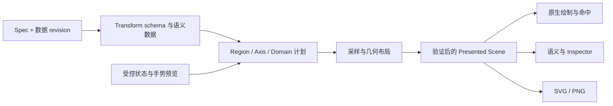

# 图表组件深度评审

日期：2026-09-23。基线：`e09b5b2febe1b20aed3f471ce5b7f841eb2980c6`（`feat(charts): add native chart runtime`），与父提交 `c3b6d439` 比较，共 66 个文件、12,907 行新增、60 行删除。审计开始时工作树干净。本轮只添加审计文档、独立复现程序和证据，没有修改产品实现。

## 结论

**架构方向值得保留，但当前实现尚不能按 ADR 0021 的完整图表契约验收。** 当前最严重的问题是图表会把合法输入画成错误含义：共享轴不共享尺度、堆叠越界、Gauge 把 25/100 画满、Radar 抹掉系列间的数量级差异。这些缺陷比缺少某一种图表更应优先处理。

第二层问题是抽象之间没有形成闭环：类型数据经过 transform 后丢失类型或无法绑定输出；“一个 scene”之外，原生 painter、导出、命中和无障碍仍各自解释数据；受控状态与原生预览没有提交协议。继续在这些基础上增加系列类型，会把缺陷复制到更多入口。

本报告按共同根因归为 **12 组：7 组 P1、5 组 P2**。P1 指会产生错误数据表达、破坏核心使用路径或关键输出的发布阻断问题；P2 指必须修复的交互、契约、扩展或验证问题。它们不是 12 个独立小补丁，建议按照后文的依赖顺序整改。

遵循项目当前阶段的政策：不要求保留旧 API，不将破坏性变更、尚未实现的 Graph/Tree/3D 等明确延期能力列为 bug。必要时应直接修正公开类型和事件结构，不增加兼容层掩盖当前设计缺陷。

证据标记：**R**＝独立程序或原生行为测试复现；**S**＝源码确认，尚未补相应端到端测试；**G**＝验收缺口，不能据此断言该行为必然错误。复现方法见 [reproduce.md](reproduce.md)，原始输出见 [evidence](evidence)。

## 本轮验证及其边界

| 验证 | 结果 | 能证明什么 |
|---|---|---|
| Workspace 全目标、全 feature、locked/offline | 537 通过，0 失败 | 既有回归通过，不能证明新图表数值语义完整 |
| 既有 native-keyboard 独立包 | 65 通过 | 该包未启用 `charts`，不是图表原生验收 |
| 既有 performance 独立包 | 4 通过，3 ignored | 默认结构检查通过，图表 benchmark 默认不执行 |
| fmt / 严格 Clippy | 通过 | 格式和静态规则通过 |
| 本轮 public 探针 | 执行完成，记录下文缺陷 | 退出 0 是探针完成，不是行为正确 |
| 本轮启用 charts 的原生测试 | **5 个期望行为断言全部失败** | 缩放、刷选、语义、适配器、数据键冲突均可复现 |
| 100k 图表 benchmark 显式执行 | debug 单样本跑通 | 仅为冒烟；不是 release 帧预算认证 |
| inline 数据转换微基准 | release、5 次预热、20 次采样 | 测数据转换，不包含完整渲染或输入延迟 |

原生失败测试使用真实的 `EmbeddedScriptView`、正式 `chart::Chart` / `BarChart` 入口、GPUI 测试窗口及输入分发；读取公开语义树和脚本状态。没有通过篡改私有 ChartEntity 状态制造故障。Motion 设为 None，排除动画中间帧干扰；图例和特殊数据键用正常输入作同位置对照。

本轮未完成实体屏幕上的所有主题、RTL、VoiceOver、120 Hz、长时间流式更新与全部平台视觉矩阵，不声称这些已经通过。审计时精确 HEAD 的 CI 查询返回空数组，仅记录事实，不据此断言整个仓库没有 CI。

## 值得保留的架构与功能判断

当前有一组正确基础：`charts` 是可选 feature；Rhai 负责声明，Rust 持有数据、几何和交互；`NativeChartData` 使用不可变快照和原子 revision，带并发追加重试；后台准备有 job 标记阻止旧结果覆盖新结果；链接成员使用弱引用；自定义扩展限定为可信 Rust 实现；导出没有给 Rhai 文件权限；严格解析未知字段，数据入口检查类型、非有限值、长度和键重复。**不建议推翻成另一个图表库，也不建议重新引入逐数据点 Rhai 回调。**

但是，“14 种系列能产生 mark”与“14 种系列能可靠表达业务数据”是两种完成度。当前适合将这一轮视为基础实现进入语义收敛阶段：

| 能力 | 当前判断 | 达到可用还需要什么 |
|---|---|---|
| Bar / Stacked Bar | 普通正值示例可画；堆叠数学错误 | 按 stack 分组计算区间、正负分离、共享域、log 基线策略；横向布局是后续明确能力选择 |
| Line / Area | 常规数值路径成立；空值与自动采样破坏语义 | 缺口、单点、类别 X、采样后原始交互索引；显式连接缺口策略 |
| Scatter | 基础数据点成立 | 正确共享轴、稳定视觉编码、原生形状与命中一致 |
| Heatmap | 类别网格入口存在 | 连续坐标单元边界、数值颜色域和图例；不能把通用 `encode.color` 的存在当作已实现 |
| Candlestick | 有 OHLC 图元生成 | 多轴、反向轴、缺失/非法 OHLC、不同采样间距的原生验收尚不足；本轮未证实这些全部错误 |
| Pie / Donut | 基础扇区比例成立 | 稳定 datum 颜色、按切片的图例/隐藏语义；当前图例是整系列级 |
| Radar / Gauge | **核心量值表达不正确** | Radar 的共享指标域、指标身份；Gauge 的显式 domain 和越界策略 |
| Funnel | 有梯形序列 | 源码总按值排序，无法保留业务阶段顺序；下边宽度为固定比例，需明确“阶段宽度”还是“相邻转化”语义 |
| Map / GeoScatter / GeoLines | 有地图、投影和几何路径 | 投影失败必须明确处理；域联动、区域刷选语义和导出一致性 |
| Transform / streaming | 数据所有权方向正确 | 输出 schema 验证、空集保型、语义数据与绘制采样分离、成本预算 |
| 键盘 / A11y / Inspector | 键盘有输入路径，scene 有辅助接口 | **实际语义树未接数据**，Inspector 没有消费图表诊断；不能用接口存在代替集成验收 |
| SVG / PNG / 自定义系列 | API 和基础流程存在 | 字体、绘制样式、坐标上下文、注册原子性和拒绝候选语义 |

## C01 · P1：坐标轴计划不共享，类型与投影的解释不一致

位置：[scene.rs](../../../crates/gpui-rhai/src/chart/scene.rs) `layout_cartesian`（921）、`layout_cartesian_group`（959）、`numeric_domain`（2470）、`map_value`（2511）、`format_axis_tick`（1663）、`layout_geo`（2238）；[scale.rs](../../../crates/gpui-rhai/src/chart/scale.rs) `ticks`（213）。

**证据与影响：**

- **R**：两个系列绑定同一个命名 X 轴、不同 Y 轴。一个数据集 X 范围 0…1，另一个 0…100。`x=1` 和 `x=100` 最终都在 `x=598`。实现按 `(x_axis, y_axis)` 二元组划分系列，再各算一份 X 域；共享轴因此只是名字共享。
- **R**：正值 Y 数据 `[1, 10]` 使用自动 log 域，返回 `Scale(LogDomain)`；Y 域通用逻辑强行包含零。即使显式 min=1/max=100，bar 又因 baseline=0 无法映射，产生 0 个数据 mark。
- **R**：数值 X `[0, 1]` 显式设 category 轴，配置接受，但无数据 mark。类别收集用了 display text，实际映射只把字符串/布尔交给类别 scale。
- **R**：显式类别轴 `Alpha/Beta` 配数字本地化 metadata，标签变为 `188.5/461.5`。类别 tick 的 value 是像素位置，却被当成数字数据格式化。
- **R**：Mercator 对 `(0, 89)` 返回 None，GeoScatter 仍生成图元且无诊断；投影失败被 `unwrap_or` 降为原始经纬度，混入投影坐标空间。

**修复边界：** 先按 `(region, axis_id)` 编译唯一轴计划，收集所有绑定系列的 domain contribution，再生成 series geometry。scale kind 决定域规则、tick 的语义类型和格式化路径。类别值应有统一的类型化身份与显示标签；log 必须定义有效输入和 bar 基线。不存在统一合法 log-bar 行为时，宁可明确拒绝该组合，也不能静默清空。投影 None 应跳过点/分段并发出有界诊断，不能切换坐标单位。

**验收：** 同一轴下同一数据值映射相同，与另一个轴绑定无关；反转/显式域/隐藏系列策略确定；正值 log 可用；数字类别在 resize 前后显示名称而非像素；投影拒绝点不出现在地图。补至少共享 X、共享 Y、多 region、linear/log/category/time 的组合测试。

## C02 · P1：内建堆叠柱状图的域和正负基线错误

位置：[scene.rs](../../../crates/gpui-rhai/src/chart/scene.rs) `layout_cartesian_group` 的域计算及 Bar 分支（约 1030–1168）。

**R**：同一类别 `10+10`，域按单项最大值 10 计算。探针中 plot 顶部为 24，第二条柱从 **y=-206** 开始，完全越过 plot。另一个类别 `+5/-4` 的负项从 +5 开始向下累计，落在 +1…+5，而不是 0…-4。

**S**：不同 stack group 没有独立的并列槽位；多个 stack 都使用零偏移，会互相覆盖。transform 模块有正负分开的 stack 逻辑，但内建 bar 另写一份累计逻辑，两者已经分叉。

**修复边界：** 先生成每个 `(category, stack_group, datum)` 的 `start/end` 区间，正负累计分开；domain 从全部区间端点而非 raw value 计算；按 stack group 与未堆叠系列统一分配 band 槽位。复用一个堆叠语义实现，避免 renderer 和 transform 各维护一套数学。

**验收：** `10+10` 完整落在合理域内；`+5/-4` 分居零线两侧；两组 stack 并列；交换系列声明顺序不改变最终正负总量与域；隐藏系列后的域策略有文档及测试。

## C03 · P1：Transform 管线不能正确组合，空值和采样改变数据含义

位置：[scene.rs](../../../crates/gpui-rhai/src/chart/scene.rs) `prepare_chart_data`（502）、Line/Area 分支（约 1169）、`series_points`（1747）；[data.rs](../../../crates/gpui-rhai/src/chart/data.rs) `select_rows`（565）；[transform.rs](../../../crates/gpui-rhai/src/chart/transform.rs) `aggregate`（258）、`downsample_lttb`（500）。

**已复现：**

| 输入 | 当前行为 | 应有行为 |
|---|---|---|
| aggregate `v → total`，encode.y=`total` | `MissingDimension("total")` | transform 输出能够参与 encode |
| 带 id 的数据过滤 `y > 99`，无命中 | `MissingKeyDimension("id")` | 合法 0 行数据集，保留 schema |
| `(0,1), (1,null), (2,3)` | 直接连接首尾两点 | 默认保留 gap；连接缺口需要显式策略 |
| 5,000 行线中一个 null | 自动 LTTB 返回 `NonNumeric { row: 2400 }`，整候选失败 | 数据规模跨阈值不能改变 null 的有效性 |
| integer 分组列 aggregate | 分组列变成 String | 保留分组值的类型和身份 |
| 5,000 行有稳定 id 的线 | 绘制/交互仅剩 4,000 行，例如 r4 不可到达 | 按 ADR 的“只影响绘制”保留原始交互与选择映射 |

根因不是缺几个 if：encode 在 transform **之前**针对源数据验证；`select_rows` 把列转回行后重新推断类型，空集/全 null 子集丢 schema；aggregate 以展示字符串分组并重建字符串列；LTTB 既负责缩减绘制又替代语义数据集。

**S**：aggregate 的 null/空字符串可能因 display text 合并；count 只数成功转成数字的项，而非通用非空项，必须明确 count 的公开语义。自动 LTTB 同样不接受类别 X。Line 的单点 marker 生成位于 `points.len() >= 2` 分支内，单点系列消失。`sampled = len_after < len_before` 又把普通 filter/aggregate 的减行标成 downsample，诊断不可信。

需要区分一个已经做对的部分：**被保留的采样行确实保留原始 key**。缺陷是未保留的行没有对应的交互数据路径，不能把这描述成“所有 key 都被重写”。若团队决定只允许对绘制点交互，需正式缩小 ADR 的契约并定义外部 selection 如何表现，不能维持当前更强承诺。

**修复边界：** 管线分为 `source schema → 各 transform 的输入/输出 schema → transformed semantic data → encode 验证 → draw sampling`。列选择保留类型/null bitmap/key metadata；分组使用类型化值；采样保留行索引映射和原始/变换后语义数据；按连续有效段采样，gap 不能被吞。filter、semantic aggregate、draw sample 分别记录 provenance 与数量。

**验收：** 不要求调用者预造 dummy 输出列；空集/全 null 子集保型；整数、时间、字符串分组不串型；3999/4000/4001/5000 行具有同一缺口语义；被采样掉的选中 key 有规定且可验证的行为。

## C04 · P1：Gauge 与 Radar 只生成轮廓，没有成立的量值模型

位置：[scene.rs](../../../crates/gpui-rhai/src/chart/scene.rs) `layout_polar`（1962）。

- **R**：单行 Gauge `value=25`，显式 radial axis `min=0,max=100`，value polygon 与 full track **完全相同**。上限来自数据集自己的最大值，单值大于等于 1 基本总画满；声明的 radial axis 未参与计算。
- **R**：同一 Radar 中 `[10,20,30]` 与 `[100,200,300]` 两系列 polygon **完全重合**，因为每系列独立除以自己的最大值。它无法支持通常的跨系列绝对值比较。
- **S**：Radar 以各系列有效行的顺序和数量决定角度；缺失指标会改变其余指标的角度，而不是保留同一指标轴。单一 `datum_key="radar"` 也不能代表各指标的原始身份。

**修复边界：** Gauge 需要显式数值 domain、起止角和 clamp/overflow 策略；额外数据行不能偷偷充当 max。Radar 需要稳定的指标集合及每个指标的共享 domain，先按指标 key 对齐，再计算各系列；若提供“各系列自身归一化”应成为明确选择，并在标签中说明。Polar 应有可复用的坐标计划，避免每种系列各自推断完全不同的尺度。

**验收：** 25/100 占 1/4 有效弧；domain 变化可验证；大小相差十倍的 Radar 在同域中不重合；指标换序、缺一个指标、全零、负值分别有确定规则。

## C05 · P1：受控 viewport 会漂移，缩放后刻度不再代表数据

位置：[primitive.rs](../../../crates/gpui-rhai/src/chart/primitive.rs) `update_config`（244）、坐标变换（413/426）、`wheel`（525）、`mark_is_viewport_fixed`（1268）、`paint_chart_scene`（1276）。

**R**：Host 固定传入 `zoom=1, pan=0`，只记录回调而不接受新值。连续三次相同滚轮手势、每次显式 Ended，提案从 `0.904837…` 累积到 `0.740818…`。`update_config` 比较新旧 props，不与本地预览值比较；相同受控值不能拒绝或纠正本地修改。

**S**：数据 mark 围绕整个图表中心进行几何放大和平移，轴、刻度和 grid 固定，且未据 viewport 重算 domain/ticks。对 Cartesian 来说，点已经离开标注值对应的位置，刻度却仍显示原值；命中反变换存在并不能修复这种数据表达错误。多 region 还共用整图中心，而非各自 plot 的 viewport。

**修复边界：** 定义 `committed viewport + transient gesture preview + proposal/ack`。受控、非受控要可区分；默认值不是“是否受控”的替代。Cartesian viewport 用 domain window 表达并重算 scale/ticks；Geo camera 可以是单独类型。即使允许 preview，也必须规定手势结束或 Host 回写同值如何回滚。candidate、presented revision 和 viewport 状态要一起提交。

**验收：** Host 拒绝/钳制/延迟接受 proposal；程序设置和手势交错；一次手势结束后保持同 props 不继续漂移；缩放后的 axis invert 与数据 mark 对齐；不同 region 不共享错误中心。

## C06 · P1：图元角色依赖业务字符串，身份和颜色不稳定

位置：[primitive.rs](../../../crates/gpui-rhai/src/chart/primitive.rs) `mouse_down`（474）、`mark_is_viewport_fixed`（1268）；[scene.rs](../../../crates/gpui-rhai/src/chart/scene.rs) 图例（811）、轴（1541）、插值（249）和 `series_color`（2638）。

- **R**：关闭 legend，数据 key 设为合法字符串 `"legend"`，点击柱子触发 `legend_change` 而非 `select`。同坐标 normal key 对照为 `select=1,legend=0`，特殊 key 为 `select=0,legend=1`。这个数据点还被当作固定 viewport 控件。
- **R**：两个 Cartesian region 使用隐式轴时，`grid:y:0`、`axis:x` 等全局 mark key 重复。插值把旧 mark 按字符串 key 放进 map，重复键使跨 region 的运动身份串线。
- **R**：隐藏前一个系列，B 的 legend 仍为 `0x7dcf91ff`，B 的柱却变为 `0x7aa2f7ff`。图例使用完整系列顺序、绘制使用可见子集顺序索引 palette。多 region / 轴组也会各自重新编号。

**修复边界：** 引入类型化 `MarkRole` 和结构身份，例如 region/series/dataset/datum/part；控件不占用 datum key 字符串命名空间。整个 scene 在提交前校验全局唯一身份。颜色和非颜色视觉样式先在完整 spec 上按稳定语义身份分配，scene、legend、export 共用结果。

**验收：** datum key 为 legend/line/radar 等任意合法值都不改变角色；不同 region、同 datum 多图元、显隐切换没有身份碰撞；隐藏/换序/resize 时同系列与其图例保持同色；运动匹配不跨 region。

## C07 · P2：手势仲裁、事件提交和跨图联动缺少完整协议

位置：[primitive.rs](../../../crates/gpui-rhai/src/chart/primitive.rs) `mouse_down`（474）、`wheel`（525）、`emit_brush`（669）、`ChartLinkRegistry`（84–169）；[chart.rhai](../../../registry/charts/chart.rhai) 事件 schema。

**R**：同一个图例位置，brush=none 时点击触发一次图例回调；brush=xy 时为零。刷选分支先于图例/annotation 判断，而且没有限定在 plot 内，控件点击被当成 brush 起点。

以下为 **S**：

- 每个非零 wheel 事件立即 defer 一次 Rhai `zoom_change`，没有按 gesture phase 合并；原生预览和低频语义提交仍共用同一条路径。没有交互禁用/修饰键策略，图表还会 stop propagation，影响所在滚动容器。
- Brush 根据所有 interactive mark 的中心收集 key，包含 legend/annotation；输出只有裸 datum key 和像素矩形，没有 series/dataset/region/domain/revision，同 key 跨系列会重复且无法消歧。`GeoRegion` 只在起点尝试吸附命中 mark 的中心，最终仍用同一矩形中心测试提交，未形成稳定的区域身份选择协议。
- 链接组的 domain 是分组字符串，不参与数值转换。联动直接复制缩放倍数和像素 pan，不同宽度或 domain 的图不会对齐到相同数据区间。hover/selection 仅按 datum key 匹配，无法表达“两个不同数据集共享时间域”。
- `linked_selected` 通过单次本地点击广播设置；没有配套的受控清空/集合替换传播。新组注册或源图程序清空 selection 不会自然撤回目标图的旧 linked selection。

**修复边界：** 先由 typed role 仲裁控件，再在特定 region 内启动手势；preview 保持 native，commit 在手势结束或有界合并策略下产生。事件带结构化 DatumRef、region、revision 与 domain 范围；Geo rectangle 与 Geo region 必须区分。链接协议使用声明域中的值/区间与 selection 集合，明确 source、清空、离组、Host 拒绝后的行为，不能靠复制屏幕像素实现域同步。

**验收：** brush 不阻断图例/annotation；拖到图外、取消手势、释放修饰键均能结束；无控件 key 混入数据选择；高频滚轮回调数有边界；不同尺寸同域图同步；selection 清空、换组、销毁后不留幽灵高亮。

## C08 · P1：PNG 丢失文字，原生绘制、命中和导出解释不同的 scene

位置：[export.rs](../../../crates/gpui-rhai/src/chart/export.rs) `export_chart_png`（61）、`scene_to_svg`（127）；[primitive.rs](../../../crates/gpui-rhai/src/chart/primitive.rs) `paint_chart_scene`（1276）、`paint_symbol`（1498）；[scene.rs](../../../crates/gpui-rhai/src/chart/scene.rs) 命中函数。

**R**：标题从 FIRST 改为 SECOND TITLE，SVG 改变，而两个 PNG **字节完全相同**。生成图片肉眼检查也没有标题、坐标文字和图例文字。[SVG 样例](evidence/export.svg) 与 [PNG 样例](evidence/export.png) 随报告交付。根因是 PNG 使用 `usvg::Options::default()`，没有配置字体数据库；现有单测只检查 SVG 字符串和 PNG 文件头。

**S**：原生 painter 根据 `series_key` 的 hash，把 scene 中的 Circle 再解释为其他 symbol，把 Rect 加 hatch，把 Polyline 加线型；这些决策未存入 scene。SVG 始终导出 Circle/普通 Rect/普通 Polyline，命中仍测试原先的 Circle/几何。于是屏幕可见边界、点击边界、导出视觉不再相同。Circle 分支还只消费 fill，不绘制 scene 声明的 stroke；合法的无 fill、仅 stroke 自定义 circle 在屏幕消失而导出可见。

**修复边界：** 文字使用显式字体解析/嵌入或一致的字形路径策略，复用仓库已解决 SVG 字体问题的公共能力，不复制一个空默认配置。symbol、dash、hatch、stroke、opacity、clip、label anchor 等必须进入已经解析的 scene；各后端执行同一绘制规范，命中按可见形状或明确容差策略计算。不要通过禁止特殊 symbol 回避一致性要求。

导出从 prepared data 重建一个 terminal scene 本身可以成立，但必须明确它与当前 viewport/selection 的关系。当前 export request 不含这些状态，不能让用户以为它是“当前画面的截图”。request.locale 目前只替换 locale 字符串，不重新解析 number metadata/direction；需要一个完整、经过验证的 locale context 或明确的一致性要求。

**验收：** 英文/CJK/RTL 标题和 tick 在 PNG 可见；更改文字使对应像素变化；屏幕/SVG/PNG 的 symbol、dash、hatch、stroke 与 clip 一致；选中导出、全域导出等模式边界明确；覆盖无字体、缺字、显式 locale 与 theme 冲突的行为。

## C09 · P2：语义投影停在辅助方法，未接入产品无障碍与诊断

位置：[scene.rs](../../../crates/gpui-rhai/src/chart/scene.rs) `semantic_projection`（229）；[chart.rhai](../../../registry/charts/chart.rhai) `render_Chart`；[primitive.rs](../../../crates/gpui-rhai/src/chart/primitive.rs) `key_down`（562）。

**R**：给 datum first 设置 selected，再聚焦图表并按 Home，公开语义树只有 `("figure", "Control", "", None)`，没有 first 或数据值。键盘能改变内部 active mark，不等于辅助技术能读到数据。

**S**：`semantic_projection` 在产品运行路径没有调用；当前方法仅取前若干 interactive marks，包含图例，不优先保留 focused/selected。键盘 focus 保存 mark 数组索引，而不是 datum identity，数据换序后可能指向另一个数据项。`chart.downsampled` / sampled_series 没有流向 Inspector 的消费路径，文档“Inspector 公开采样量”的承诺未兑现。

**修复边界：** 将 chart 的有界数据语义接入已有 accessibility/automation 通道，至少提供摘要、active datum、selection 状态、动作和可浏览的有限数据窗口；优先保证 active/selected 可达，而不是把前 1,000 个 mark 原样塞进去。以 DatumRef 保留焦点，数据删除时定义 fallback。Inspector 显示 source/presented revision、候选错误、transform provenance、输入/语义/绘制数量、交互截断与预算状态。

**验收：** 公开 accessibility snapshot 可以读到键盘焦点项和数值；selection、流式删行、换序保持正确身份；焦点落在第 1,000 项之外仍可读；错误候选和下采样状态出现在 Inspector。另安排真实 VoiceOver 验收，GPUI snapshot 通过不能替代屏幕阅读器使用测试。

## C10 · P2：热路径仍重复做数据准备，性能目标缺少可执行的门槛

位置：[primitive.rs](../../../crates/gpui-rhai/src/chart/primitive.rs) `render`（1014）、`parse_config`（1074）、`same_source`（47）、`rebuild_scene`（329）、`set_bounds`（370）；[scene.rs](../../../crates/gpui-rhai/src/chart/scene.rs) 交互 cap（681）；[e2e.rs](../../../tests/performance/tests/e2e.rs) 图表 benchmark（932）。

**S**：每次 primitive render 都先完整解析 spec、克隆 inline rows、重新构造列和 NativeChartData，然后才进行数据相等比较。文档“数组只转换一次”与实现不符。数据不变的主题、父视图更新也不能在这条路径上跳过转换；原生路径不执行 Rhai 并不代表没有 O(N) 工作。

**R（成本表征）**：独立 release 微基准（Apple M1、macOS 26.6.2、Rust 1.94.0），预构造输入，仅测 clone rows + from_rows + NativeChartData::new，5 次预热、20 次采样：

| 行数 | p50 | p95 |
|---|---:|---:|
| 1,000 | 0.726 ms | 1.442 ms |
| 10,000 | 7.448 ms | 7.810 ms |

这些是本机一次数据阶段测量，不是完整 frame 耗时，也不能直接推算每个 mouse move 都付出此成本。它足以说明缓存命中之前重新转换 10k 数据不是可以忽略的操作。实际输入路径的调用频率应加计数器验证。

**S**：后台任务处理 transform/sample，但 scale、geometry、geo 和 custom layout 仍在 `rebuild_scene` 的前台调用中完成；bounds 只改变 origin 也会全量 relayout 并重启 transition。交互上限仅把超过 10k 的 mark 标成不可交互，并不限制总 mark/vertex/paint 成本；legend 也占同一计数。普通命中逆序线性扫描，没有空间索引。流式 append 的全列复制成本也需要独立预算，不能由“版本合并”自动消除。

显式运行已有 100k benchmark 的 debug 单样本记录 prepare=826.417ms、mount=340.819ms、resize=169.439ms、streaming=255.493ms，Rhai operations=0。**这不是 release 性能结论。** 更关键的是该测试没有断言目标数据 revision 已经成为 presented scene、也没有断言最终 mark 数量；仅输出 timing 和 operations，不能自动守住产品性能契约。

**修复边界：** 缓存持久的 parsed spec 和 inline typed snapshot，用明确内容 revision/identity 失效，避免“先重建再判等”。拆开数据准备、尺寸依赖布局和 origin 更新；为 raw rows、vertices、marks、hit candidates、准备队列、单帧采样分别预算。对可信 custom renderer 的预算也是资源契约，不是把可信扩展当恶意代码。只把确有收益的纯 CPU 准备移出前台，GPUI 操作留前台。

**验收：** 不变数据的 hover、焦点、父更新、origin 移动不重建 typed data；burst 更新有界且最终 revision 可观察；release 原生基准等待“目标 revision 实际呈现”，分别记录冷启动/resize/gesture/streaming、p50/p95/p99、分配及 Rhai 操作数。在参考硬件上确定实际帧预算，再设置 CI 回归门槛。不能把一次 debug 样本包装成性能保证。

## C11 · P2：扩展注册失败仍然修改状态，自定义坐标能力不足

位置：[transform.rs](../../../crates/gpui-rhai/src/chart/transform.rs) `register`（65）；[extension.rs](../../../crates/gpui-rhai/src/chart/extension.rs) `ChartCustomSeriesContext`、series/formatter `register`（67/260）；[geo.rs](../../../crates/gpui-rhai/src/chart/geo.rs) register（320/336）；[scene.rs](../../../crates/gpui-rhai/src/chart/scene.rs) Custom 分支。

**R**：先注册 transform 返回常量 1，再对同 ID 注册返回 2 的实现。第二次返回 Duplicate 错误，但后续实际执行结果为 2。原因是 `insert(...).is_some()` 先替换再报告错误。**S**：series、formatter、map、projection 使用相同模式；“Err 保留既有注册”这一基本原子性被破坏。

**R**：声明一个合法 Custom Polar 系列，不提供 Value encode，已注册 renderer 的调用次数为 0，输出数据 marks=0，diagnostics=[]。`layout_polar` 在分发 Custom 之前先要求内建 Value 列。

**S**：公共 context 只有可选 x/y scale、bounds、dataset、theme 等，缺少类型化 Polar/Geo mapper、域贡献入口；series 扩展没有自己的 options 契约，返回值只含 marks，没有 labels/语义/诊断等完整布局结果。结果是扩展能生成基本图形，却很难复用承诺中的坐标和服务。

**修复边界：** register 使用 Entry，在锁内检查后插入；replace 若有需求应单独显式 API。分发自定义系列先按自定义协议校验，不能继承不相关的内建必需列。引入按坐标类型区分的上下文、类型化 options（或 Host 验证 schema）、domain contribution 与完整 layout result；明确 prepare/layout 所在线程和预算。

**验收：** 每个 registry 的重复注册错误后原值不变；自定义 Cartesian/Polar/Geo 最小实现均真正被调用并能复用坐标；返回非法几何/重复身份/超预算时原子拒绝候选；不要求扩展作者复制 runtime 的轴和格式化逻辑。

## C12 · P2：已公开字段和便捷适配器没有可依赖的行为

位置：[chart.rhai](../../../registry/charts/chart.rhai) `specialized_chart`（约 93–141）；[spec.rs](../../../crates/gpui-rhai/src/chart/spec.rs) encode/axis/tooltip；[primitive.rs](../../../crates/gpui-rhai/src/chart/primitive.rs) theme 与 tooltip 渲染。

**R**：调用 `chart::BarChart` 并传入完整 spec，其中 series 只有 key/encode、没有 kind，适配器生成的 primitive spec 仍缺 kind。Rhai `for series in chart_props.spec.series { series.kind = kind; }` 修改的是迭代值，没有写回数组。该分支本来用于补充/覆盖 kind，实际失效。

以下为 **S**：

- `encode.color` 被接受及校验，却没有参与最终颜色编码；`axis.title` 没有布局消费；`tooltip.shared` 没有聚合同轴数据行为。tooltip 数值也没有复用 axis 的 formatter/locale 管线。
- `charts.tooltip_surface/text` 被主题捕获，但实际 tooltip 仍使用通用 background/text，不消费这些 role。
- formal 专用组件与 chart 模块便捷函数的 props 约束不完全一致，例如已有 full spec 仍可能被要求传 encode。单一功能存在多份 schema/默认值，容易继续漂移。
- `compact` 数字格式在有 number metadata 时先进入常规数字格式分支，无法兑现 compact 选择。固定 52/24 等边距和 label 固定像素偏移没有文本测量；小 viewport 的 region 宽高在减 18 后可为负，长标题/多图例/本地化尚无可靠避让。

**修复边界：** 逐字段建立“解析 → 校验 → 编译 → 布局/交互 → 导出/语义”的消费映射；暂不实现的字段明确拒绝或移出公开契约，不能成功接受后无效果。专用适配器通过一种确定的 spec normalization 规则工作，并以一次 schema 定义生成/共享默认值。数值格式与文本布局统一进入 scene 编译；拥挤时的隐藏、截断、换行策略要可预测。

**验收：** 所有 14 个适配器的简写与 full-spec 两条路径；每个公开字段至少有一个会改变结果的行为测试；无效果字段的测试应失败而非只验证 parser 接受。覆盖数字 metadata + compact、tooltip token overrides、64px 小尺寸、多 region 和长类别文本。

## 建议的收敛架构

不建议现在为“架构整洁”再拆一个 crate，也不建议先写更大的系列工厂。当前需要建立几处真实的不变量，文件拆分可以随之完成。

### 1. 把“意图、语义数据、显示数据、已呈现场景”分开

`ChartSpec` 是用户意图，不承担临时坐标和手势状态；transform 输出是带 schema 的语义数据；draw sample 是索引/映射与几何简化；presented scene 带 revision、完整已解析视觉样式和语义身份。这些层之间可共享 Arc 数据，不等于复制多份大表。

不要只把 parser 和 painter 拆成更多函数：如果输出列仍先于 transform 验证、各系列仍各算 domain，再多模块也不会修复错误。先为每层定义输入/输出和保持不变量，再抽公共逻辑。

### 2. 一个 coordinate plan 负责一个坐标事实

Cartesian 的共享轴域、Polar 的指标/半径域、Geo 的投影各自有类型。系列提交 domain contribution，而不是越过计划直接创建私有尺度。annotation、brush、tooltip、联动和 export 都通过相同 mapper/inverter。空域、zero baseline、log 非正值、方向、时间 zone 都在这一层定义。

### 3. 图元身份、数据身份和控件角色必须分开

建议形成 `DatumRef { dataset, series, key }` 与 `MarkId { region, role, datum, part }` 一类结构；命名可以调整。一个 candlestick 的 wick/body、Radar 的系列轮廓与指标、legend item 都不能假装是同一类 datum。selection/focus/brush/linked state 以语义引用为准，再投影到 marks。

### 4. 公开 API 采用按能力划分的类型

当前扁平 series bag 难以表达正确的 Gauge/Radar/Heatmap/Custom 参数。可以保留 Rhai map 的易用性，Rust 内部解析为按 series kind 区分的 enum；只允许适用字段。应尽早明确：

- Gauge domain、Radar 指标域、Heatmap 颜色域/单元边界、Funnel 阶段顺序；
- 稳定的 symbol/dash/hatch 与 color 编码，避免将无障碍样式隐藏成 key hash；
- viewport 的受控/非受控状态，以及 enabled/modifier/axis 交互策略；
- 事件的语义坐标、revision、DatumRef 与 commit 时机；
- custom 扩展的 prepare/schema/domain/layout 协议，以及 terminal export 接受的状态快照。

不必一次补齐所有产品开关。对尚未实现的组合明确拒绝，比增加一个成功解析但无效的字段更容易持续迭代。当前允许 breaking change，正适合在真实使用面扩大前修正这些类型。

### 5. 最后成功场景要作为一个事务提交

当前有保留旧 scene 和丢弃旧 job 的良好基础，但 `config`、`prepared`、`scene` 在不同阶段更新。建议建立 immutable candidate，包含 spec/data/theme/viewport revision、布局、语义和诊断，全部验证成功后原子替换 presented state。候选错误只更新错误面板；旧图的命中、回调身份、zoom 和导出仍指向同一 presented revision。

这项属于源码暴露出的设计风险，尚未在本轮构造完整的异步混合状态失败用例；不要把它与前述 R 级缺陷混为已复现结果。整改时应补故障注入：解析失败、transform 失败、layout 失败、custom 返回坏 mark、快速换主题/数据、卸载后 job 完成。

### 6. Motion 与生命周期需要单独验收

当前复用 clock、主题 duration/easing 和 normal/reduced/none 的方向合理，但图表仍在自己的 scene 插值与 animation frame 路径中运行。“一个聚合资源”不能自动证明已经遵守全局 suspend、预算拒绝、窗口 teardown 等 MotionRuntime 契约。此处列为 **G**，不直接断言发生泄漏或窗口隔离 bug。

应验证：None 立即终态、Reduced 有界、suspend 无继续采样、resume 的进度策略、预算被拒绝不启动、窗口/视图卸载取消准备和订阅、旧域 link 不残留，以及快速数据更新时 transition 的身份和峰值内存。此前动效整改的行为探针不能替代新 ChartEntity 路径的验收。

## 建议实施顺序与完成定义

| 批次 | 范围 | 合并前必须看到的证据 |
|---|---|---|
| A：数据与数值语义 | C01–C04；先 schema/轴计划，再堆叠和 Polar | 确切坐标/域/类型/gap 断言；声明顺序、阈值两侧、空集、共享轴均覆盖 |
| B：身份与交互 | C05–C07；同时落地结构身份 | 本轮缩放/刷选/特殊 key 测试转绿；不同尺寸联动、拒绝 proposal、clear/leave/unmount 测试 |
| C：统一呈现与 API | C08/C09/C11/C12 | PNG 可见文字；scene/painter/export 同样式；公开语义含焦点 datum；重复注册无副作用；所有适配器路径 |
| D：性能与发布验收 | C10；Motion/生命周期/视觉矩阵 | 参考硬件 release 基准、有界队列/预算、目标 revision 确实呈现，全部系列真实帧与主题/locale/RTL 验收 |

避免只根据探针名称修局部 if：例如特判 `legend` 为保留字符串会继续留下其他身份碰撞；给 Gauge 硬编码 100 会继续缺失 domain；给 log 的 min 硬塞 1 会错过小于 1 的数据；对空过滤返回一个无列 dataset 会继续破坏后续 pipeline。验收必须守不变量。

### 测试体系应补的三层

1. **数学和变换性质测试**：共享轴映射相同、堆叠总量守恒、正负不串线、比例/域一致、类型和空 schema 保持、projection round-trip/拒绝策略。具体数值断言比“marks 非空”更有价值。
2. **原生行为测试**：通过正式组件入口修改受控值、模拟手势、等待 presented revision，再读取事件/语义/几何。独立测试清单必须显式启用 charts；CI 正常路径包含这些测试，不能只放 ignored benchmark。
3. **跨后端与视觉测试**：确定字体、主题、尺寸，检查文字实际存在、series 颜色稳定、symbol 与命中一致、SVG/PNG 与 native scene 对应。对全部系列挂载至少一个非退化数据集，再按主题/RTL/小尺寸/Reduced/None 配对扩展矩阵，避免只做一张漂亮 gallery 截图。

现有 export 测试名为“同一终态场景”，实际只验文件头；builtin series matrix 主要验产生 mark。这类测试可以作为 smoke 保留，但应改名反映它们真正保护的行为，防止后续模型/开发者从测试名称误判已经验收。

## 交接材料

- [public 探针](probes.rs)：共享轴、堆叠、null/empty、transform 输出、Gauge/Radar、类别/locale、导出、身份、registry、custom Polar、Geo 拒绝等。
- [原生测试](native-probes.rs)：5 个期望行为断言，基线全部失败。
- [release 微基准](bench.rs)：inline 数据转换成本，分位数采用 nearest-rank。
- [复现入口](reproduce.py) 与 [命令和解释](reproduce.md)。
- [public 输出](evidence/public.log)、[原生输出](evidence/native.log)、[已有测试输出](evidence/workspace-tests.log)、[benchmark 冒烟](evidence/chart-smoke.log)、[release 微基准输出](evidence/bench.log)。

本轮没有修改实现、提交代码或操作 GitHub issue。后续实施不应只以既有 537 项继续通过作为完成标准，应同时满足本报告各组的行为验收，并对任何主动缩小的能力承诺同步修改 ADR、API、文档和测试。
