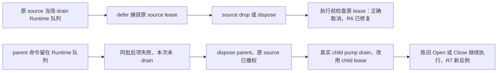

# 第七轮窗口授权验收

基线：PR #104 head `cda11ce7d80f817e5675543cc7a95f577b977320`，对比 `83b19b1d`。日期：2026-10-02。

## 旧问题修复有效

第六轮原三个 public API probe 本轮全部通过：显式 dispose、最后 Handle drop 后交接给新 Host、同 Host 同 view-id 的旧呈现实体清理，均不再撤销或关闭 replacement。新增普通 Handle clone 对照也通过：只 drop 一个 clone 不会撤权，竞争 owner 仍被拒绝，原 owner 仍能关闭自己的窗口。

这与源码相符：每次 mount 有独立 lease，unregister 比较 mount identity；native target registration 也保存 authority，deferred Close/Focus 同时检查 source 和 target 当前授权。不能将本轮的新组合缺陷描述为 R6 修复完全无效。

## R7-CORE-1 · P1：共享窗口命令队列丢失原始发起者，已撤权命令被存活子窗口重新授权

**新增 public API 反例确认；Close 和 Open 两个表现属于同一个根因。** 当前校验的是“正在 drain 队列的 View”的 authority，而队列中的命令不保存真正的发起者。

### 可执行复现

1. 通过 `mount_window` 挂载 parent，并通过其真实节点 callback 调用 `ctx.open_window("child", ...)`。GPUI 实际有 parent、child 两扇窗口。
2. parent 有两条截止时间相同的正常声明式 timer。第一条成功入队一个窗口命令；第二条抛出一个独立的脚本错误。
3. 在同一个 Host update 内执行 `AdvanceTime(100)`；得到第二条的错误后立即 `dispose` parent View。Rust parent window 本身保留，这是公开 dispose 的既有语义。
4. 存活 child 的正常 16ms Runtime pump 消费共享队列。

两种第一条命令的实测结果：

| 原始 parent 入队命令 | 撤权后期望 | 实测 |
| --- | --- | --- |
| `close_window("child")` | 两扇原生窗口保留，child 不被旧 source 关闭 | 窗口数 2→1，child 消失 |
| `open_window("late", ...)` | 不再替已 dispose 的 source 创建窗口 | 窗口数 2→3，新增 late 窗口 |

这不是模拟不存在的跨 Runtime 行为。`open_secondary_window` 为 parent/child 使用同一个 factory Runtime 和 native registry，正式组件运行时本来就共享该命令队列。测试使用公开 mount、Rhai timer、公开 Automation、公开 dispose 和真实 GPUI secondary window。

### 两个排队阶段的区别



R6 的撤权发生在 Runtime queue 已被原 source 取出、native 操作已经 defer 之后；本例的撤权发生在 Runtime queue 被任何 View 取出之前。因此通过旧 defer probe 不能覆盖这一次来源丢失。

### 根因与定位

- `window.rs:58–61`：`WindowCommand` 只有 Open(spec)、Focus(id)、Close(id)，没有 source/window mount identity。
- `window.rs:223–261`：`request_*_from` 在入队时检查 source 权限，但随后调用无来源的 `request_*`，丢弃来源。
- `app.rs:5292–5306`：同批后续 delivery 失败后，成功项已提交的窗口命令留在队列，只有总结果 Ok 时在尾部执行 `process_window_commands`。独立项的成功提交本身没有错误；错误是后续执行时认错发起者。
- `context.rs:506` / `window.rs:309`：source dispose 删除它的逻辑窗口 record，但命令既没有 source，便也不能按该 source 取消。
- `app.rs:4929–4947`：child pump drain 共享队列后使用 `self.window_authority`，实际上拿 child 的有效 lease 为 parent 的旧命令授权。
- `app.rs:4972–4983`：deferred Close/Focus 又捕获当前 drainer 的 `state` 和 `authority`，所以新增的双重校验也无法识别原始 source 已撤权。

Close 路径的 target 本身仍合法且当前，因此 target 校验通过是正常的；缺的是不可替换的原始 source 身份。Focus 走同一代码分支，但本轮未另外测它，不能把推导当成第三个独立复现。

不能用“入队时已经授权”解释这一现象：R6 和本轮显式规定，尚未实际执行的命令要在 source 撤权后失效。新实现对立即进入 defer 的 Close 已做这个检查，唯独共享队列的路径把 source 换成了 peer。

### 整改边界

排队命令应保存原始 source 的 window/mount/authority 标识，并在执行时验证该来源仍是有效 owner。可以由任意前台 pump 执行工作，但 pump 只是执行者，不能成为新的授权者。源 lease/epoch 应在入队时确定，不应在 drain 时根据当前 `self` 重新推断。

整改范围限于窗口命令记录、窗口注册表及原生执行边界，沿用本轮已经完成的 mount lease。无需借此扩建所有事件、任务或 callback 的通用调用来源系统。

保留已有 target actual WindowId/authority 校验。source 撤权、native close、同 ID remount 后，来源失效的 Open/Focus/Close 都应成为明确的取消/no-op。取消尚未创建的 Open 时，还必须释放它的 Pending window reservation，避免之后合法 owner 使用同 ID 时遇到永久 Duplicate/NotOpen 状态。

不要通过回滚整个 async batch 或禁止合法 secondary-window pump 来掩盖问题；这会改变已经明确的独立事务和多窗口运行规则。若有可信 Rust Host 直接排队命令的入口，应给它明确的 Host origin，而不是继续依赖隐含的当前 View。

最小验收补充：

- 本轮 Close/Open 反例以及 Focus 同分支；source 存活的对应合法对照。
- 成功→失败、失败→成功和多个独立成功项，通知/诊断可汇总，但每条命令 origin 不变。
- source dispose、最后 Handle drop、源物理窗口关闭、同逻辑 ID 新 mount，peer 不得替旧 lease 获权。
- target 同名替换、不同 Host/WindowId 的原有隔离继续通过。
- 撤销 Open 后，后续有效 source 能正常重新使用目标 ID。

## 本轮运行结果

```sh
python3 docs/audits/2026-10-02-interaction-0.1.8-round7/runtime-core/run-probes.py
```

源码：[probes.rs](probes.rs)。完整日志：[probes.log](probes.log)。

| Probe | 结果 |
| --- | --- |
| `explicit_dispose_revokes_queued_authority_control` | PASS，原 R6 对照 |
| `dropping_last_handle_revokes_queued_authority` | PASS，原 R6 缺陷已修复 |
| `late_old_view_cleanup_cannot_unregister_same_id_replacement` | PASS |
| `dropping_one_clone_keeps_current_owner_authorized` | PASS |
| `disposed_source_close_is_not_reauthorized_by_secondary_pump` | FAIL，确认 R7-CORE-1 Close 表现 |
| `disposed_source_open_is_not_reauthorized_by_secondary_pump` | FAIL，确认 R7-CORE-1 Open 表现 |

最终 **6 项：4 PASS、2 FAIL；计为一个新 P1**。未运行整个 161 项正式 native suite；该部分由主审负责。

唯一临时前缀 `gpui-runtime-core-round7-audit-`、target `runtime_core_round7_audit`，复用 `tests/native-keyboard/target`。本次小 suite 增量编译 3.11 秒，未创建新 profile、仓库快照或大型 target。只新增本轮材料，未修改产品或历史审计。disktree 不在本轮范围。
