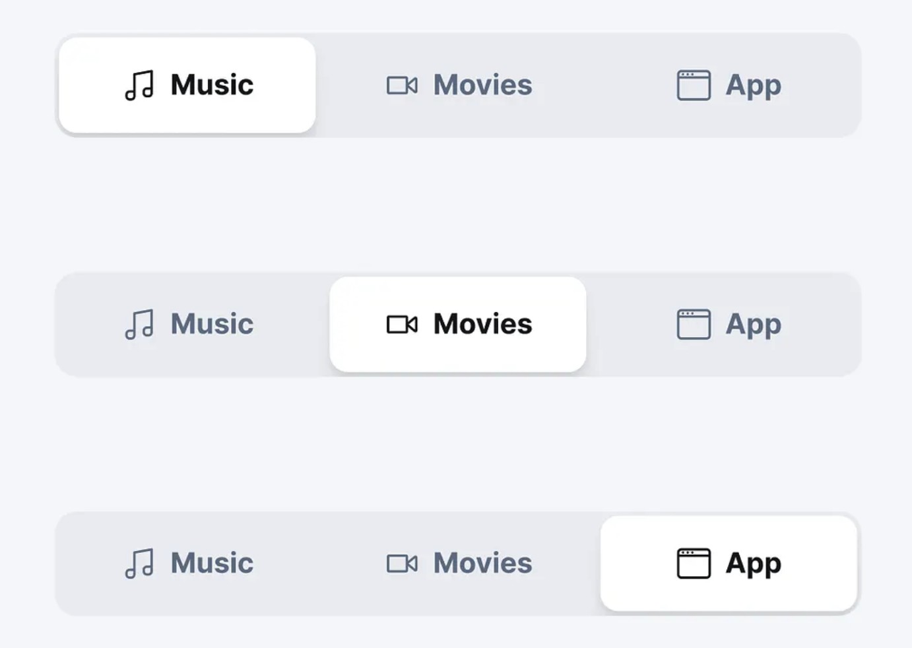
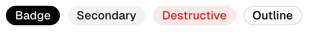
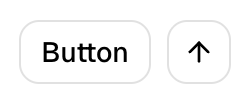

# Tabs、Button 与 Badge 视觉规格（含 ToggleGroup 后续参考）

状态：**Tabs、Button、Badge 已在 0.1.5 实施并通过原生几何/交互验收；ToggleGroup 与滚动项自动 reveal 留作后续**。
日期：2026-09-23。

本文记录本轮组件视觉调整的目标契约，不表示当前源码已实现。入口为
[官方视觉系统](../registry-design-system.md) 和 [组件目录](catalog.md)。
本轮以本文替换旧规范中的 Tabs「选中边线」规则；不保留该外观作为默认样式。

## 1. 目标与范围

- **Tabs**：连续背景槽包住所有选项，单个内嵌高亮滑块表示当前内容页；未选中项直接呈现为背景槽上的文字或图标。
- **ToggleGroup**：本轮不修改；第 5 节仅保留后续设计参考。
- **Button**：具有独立操作空间的动作控件。
- **Badge**：紧贴文字的信息标记，明显减少上下和左右留白。区别不能只靠颜色。

本轮修改组件默认视觉、必要的样式 parts，以及 Tabs 图标/宽度布局表达。
保持受控值归属、语义事件和键盘操作的职责边界。Panel 内容布局、全局字体尺度、
窗口外观和其他组件不借此全面重设计。Tag 的紧凑 metadata 身份继续保留，不作为
Button 或 Badge 的替代入口，也不在本轮新增可选择 Tag 功能。

本文所有 px 都指逻辑尺寸；参考截图可能经过缩放，不能直接将截图像素作为控件尺寸。
规格数值是本项目的桌面默认值，不是声称所有业界组件都采用这些数值。

## 2. 用户确认的视觉参考

### Tabs：背景槽与滑块

图中三行表示同一组件的三个选中状态，不是三组需要同时存在的 Tabs。
需要复现的是背景槽、单一高亮滑块、裸露的未选中文字/图标以及滑块四周的留白。
不照搬截图的放大尺寸、图标内容或阴影强度。

### Badge 与 Button：文字占容器的比例

Badge 的容器贴近文字，Button 的容器提供明显的操作空间。Badge 可以是实色、弱底色或
描边样式；黑底白字不自动意味着 Button。圆角、色彩、字重都不能替代留白比例。

## 3. Tabs 的强制视觉规则

### 3.1 结构

`root` 包含 `list` 和 `panel`。只有 `list` 是滑槽，不能把内容 panel 也装进选项背景槽。

`list` 必须有一个连续、可辨认的背景面，包住所有 tab hit slots。
选项之间**没有分隔线、单项边框、独立按钮底板或旧式下划线/侧边选中线**。
非选中项呈现为背景槽上的文字或图标；hover 时可增强前景，不产生第二块类似选中项的底板。

有效选中值只对应**一个**高亮滑块。滑块位于标签/图标下方，不能盖住内容、截获点击、
形成额外焦点或额外语义节点。选中项的文字/图标使用高对比前景。

### 3.2 四周留白是不变量

默认滑槽四边内缩量 `I = 3px`。滑块及其装饰始终位于该 inset 形成的内框之内。
滑块在首项或末项时，与背景槽的外侧边缘也必须相隔 3px；不能只给中间选项留白。
垂直 Tabs 同样适用，首末项的上下边距不能消失。

默认不绘制阴影。若应用增加阴影，其可见范围必须仍在背景槽内，并保留能看见的背景间隔；
不能以阴影、外描边或 focus ring 把间隔填满。组件默认 focus 采用内侧边框/描边。

内缩来自 `list` 的真实布局 padding，不能仅用滑块圆角制造「好像有空隙」的效果。
所有 hit slots 按相同尺寸布局；切换选择不会改变槽、选项或 panel 的位置。

### 3.3 默认几何

| 属性 | 默认值 / 规则 |
|---|---|
| 横向 list 高度 | `max(32px, 实际文本行高 + 14px)`；Default 主题下 32px |
| 垂直单项槽高 | 与横向 list 的内框高度一致，Default 下 26px |
| list 四边 padding | 3px |
| 相邻选项间 gap | 2px；这是背景槽露出的间隙，不是分隔线 |
| 滑块高度 | 横向 list 高度减 6px；Default 下 26px |
| 文本项左右 padding | 各 10px，计入 tab slot 宽度 |
| 图标与文字间距 | 6px |
| 图标框 | 14px，随文字行高增大时应保持光学协调 |
| 纯图标项 | 默认正方形 slot，边长等于滑块高度 |
| 外框 / 滑块圆角 | 8px / 5px，内外轮廓与 3px inset 协调 |
| label 字体 | `body`，500 字重；选中时不改变字重或测量宽度 |
| list 与 panel 间距 | 保留现有 6px；panel 本轮不重新设计 |

圆角是 Tabs「滑槽＋滑块」的局部结构默认值，构成对旧版全局方形几何规则的明确例外。
不为这个例外改写所有主题的 `sm/md/lg` radius，避免连带改变 Button/Input/Panel。
通过 `list` / `indicator` 的组件样式覆盖可以定制圆角，但必须保留四边 inset。

### 3.4 宽度与溢出

- 新增 `layout: "content" | "equal"`，默认 `content`。
- `content`：每个 tab 按其文字/图标与 padding 得到自然宽度；不同长度不强制等宽。横向 list 默认贴合内容。
- `equal`：横向 list 在调用者提供的可用宽度内等分；用于需要均匀铺满的导航，例如参考截图。未提供有限宽度时，按最宽自然项建立等宽组。
- 垂直布局中，所有项占满同一个侧栏横向内框，行高一致；`layout` 不把整个侧栏高度等分为巨大按钮。
- 选中滑块绑定目标 slot 的实际位置和宽度；不能用 `index × 第一个 tab 的宽度` 推算。
- 水平方向空间不足时保持单行，使用局部横向滚动；不换成多行按钮组，也不压缩到文字裁切。
- 0.1.5 提供局部横向滚动，但不承诺受控值变化后的自动 reveal；该行为需要提交后的通用 scroll-to-ref effect，留作后续底层能力，不能用渲染期副作用伪造。
- 特别长的单项应受可用内框宽度限制，文字省略并可读取完整名称，不能扩张整个窗口。

### 3.5 配色与状态

默认使用已有通用语义颜色，不引入必须由所有应用主题新增的 Tabs 专用颜色 token：

| 部位 / 状态 | 默认映射 |
|---|---|
| 背景槽 | `surface_hover` |
| 高亮滑块 | `surface_raised` |
| 未选中前景 | `text_muted` |
| 选中前景 | `text_primary` |
| 未选中 hover 前景 | `text_primary`；保留透明单项背景 |
| 键盘 focus | `focus_ring`，1px 内侧可见边界，不改变布局 |
| disabled | `disabled` 前景，禁止交互；已选中且 disabled 时仍保留选中归属 |

这里的“高亮”是与背景槽形成可辨识的选中面，不要求一定使用品牌 accent。
默认浅色主题是浅灰槽配更亮的滑块；深色主题按本主题 surface 层次呈现，不硬编码白色。
应用可通过 `indicator` / `tab_selected` parts 改为 accent＋on_accent 等配对颜色。
全部内置主题都必须能看清槽与滑块；若两色过近，采用内侧低对比轮廓辅助，不恢复旧选中边线。

状态是叠加关系：selected 的滑块持续存在，focus 叠加独立可辨认的边界；hover 不覆盖 selection，
disabled 阻止操作但不能将已经选中的项目画成未选中。按压不改变尺寸、不缩放整个槽。

### 3.6 切换动效

提供非空且同一视图内唯一的 `motion_key` 时，正常 motion 策略下滑块沿背景槽在旧、新 slot 之间移动；不同宽度时同时平滑改变宽度。未提供时直接定位。
采用现有 Motion 的 `fast` duration、`standard` easing、feedback intent。
使用不会越过槽边缘的轨迹，不做弹跳、过冲或左右留白消失的伸缩。

首次呈现直接落在当前项，不从角落飞入；Resize、主题/字体变更、RTL 切换优先对齐重新测量的
槽几何，不播放跨旧坐标系的长距离动画。快速连续切换从当前可见位置接续。
Reduced / None 立即定位滑块；panel 不附带整页淡入或滑动。

选择事件仍是一次语义提交，动画帧不执行 Rhai 回调。滑块跟随调用者接受后的 `value`，
不能仅因 pointer hover、keyboard focus 或一个未被接受的 change 提案永久移位。
动画期间，hit slots、selected 语义和 panel 都由已提交 value 决定，不能从滑块途经的位置反推。

`motion/animated_tabs` 若继续作为公开组合提供，必须继承同一套外观和受控值；
当前整棵 Tabs 的 opacity replay 不能被当成这次滑块动效的实现。

## 4. Tabs 的公开契约与样式入口

保留 `value`、`tabs`、`orientation`、`label`、`on_change` 与 `change(string)`。
保留现有单一 Tab 键入口、方向键选择、disabled 跳过和水平 RTL 规则；不得因更换外观退化成
一串各自独立 Tab stop 的 Button。

本轮增加的目标 props：

| 位置 | 字段 | 契约 |
|---|---|---|
| Tabs | `layout` | `content` / `equal`，默认 `content` |
| Tabs | `motion_key` | 可选稳定身份；非空时 indicator 使用共享布局动效。多个 Tabs 不得复用同一 key |
| tabs[i] | `icon` | 可选 node，仅作非交互展示，使用已有图标资源/公开节点 |
| tabs[i] | `label_visible` | bool，默认 true；false 时必须有 icon |

每项仍要求文本 `label`，即使视觉上只显示图标。`content` 始终表示对应 panel 内容，不能
复用成 tab header。图标本身不产生第二个 click handler 或焦点入口。
当前示例及 `AnimatedTabs` 包装需同步 schema，不能出现基础组件可用、包装组件拒绝同一字段的情况。

必须公开且在 schema 中声明下列 parts：

| part | 职责 |
|---|---|
| `root` | list 与 panel 的总体布局 |
| `list` | 连续背景槽、inset、圆角、overflow |
| `indicator` | 单个高亮滑块的填充、内侧轮廓与圆角；非交互 |
| `tab` | hit slot 的布局和通用交互样式 |
| `tab_selected` | 已提交选中项的文字/图标前景等差异；不能额外画第二块底板 |
| `label` / `icon` | header 内部文字及图标布局 |
| `panel` | 内容区域，保留既有职责 |

样式仍按组件默认 → `ui/styles.rhai` → 实例 `style/part_styles` 合并。
代码落地前，新增字段/parts 尚不可使用；实施时须一起更新 source schema、文档与测试。
没有历史兼容包袱要求，不需要为旧选中边线保留分叉实现。

## 5. ToggleGroup 后续设计参考（不属于本轮 0.1.5 实现）

本文的 Toggle Button Group 对应 `components/toggle_group`，不能与普通 `ButtonGroup` 的布局职责混淆。

| 属性 | Tabs | ToggleGroup |
|---|---|---|
| 用途 | 切换关联内容 panel | 工具/选项的 pressed 状态 |
| 选中数 | 单一有效当前页 | 依 mode 单选或多选，可按 allow_empty 清空 |
| 背景结构 | 一个槽，内部单个滑块 | 相邻的按钮段 |
| 选项间边界 | 没有分隔线 | 持续可见的 1px 分隔线 |
| 默认宽度 | 随内容，可显式 equal | 同一组所有按钮等宽等高 |
| 未选中项 | 背景槽上的裸文字/图标 | 可辨认的按钮段，具有分界和按钮反馈 |
| 选中形态 | 四边内缩的滑块 | 选中按钮段填充自身区域，不套 Tabs 的 3px 槽边距 |
| 状态语义 | tab 的 selected/current 及 panel 关系 | button 的 pressed |

ToggleGroup 的相邻段只画一条分隔线，不能叠出 2px 接缝，也不能在 selected/hover 时消失。
无指定宽度时，横向组按最大自然项宽度分配；有宽度时等分。垂直组所有项同宽同高。
全部纯图标的组可用等大的正方形按钮；混合不同文字长度时仍等尺寸。
这些约束属于 ToggleGroup；不要顺手强迫独立 Button 或所有普通 ButtonGroup 等宽。

当前 ToggleGroup 是否采用等尺寸/分隔线将在后续单独实施和验收；本轮不顺手扩大范围。
保持原有 `mode`、`values`、`allow_empty` 与 `change(array)`，不改造成 Tabs 的选中模型。

## 6. Button 与 Badge 的密度规格

### 6.1 必须保持的比例

Button 是有留白的操作区域；Badge 是紧贴文字的标记。比较同一文本、同一色彩 variant 时，
Badge 仍必须明显更紧凑。仅缩小字号，或仅换成浅底色，不算完成。

尺寸依据实际**行盒**，不是可见字形包围盒。主题和 Host 字体仍拥有最终字体与行高。
本轮不全局改写 typography token，也不把上一轮讨论中的示意 14px 字号硬编码进所有按钮。

### 6.2 默认值

| 组件 / 尺寸 | 字体角色 | 最小高度 | 左右 padding（每侧） | 字重 |
|---|---|---:|---:|---:|
| Button xs | body_small | 24px | 8px | 600 |
| Button sm | body | 28px | 10px | 600 |
| Button md | body | 32px | 12px | 600 |
| Button lg | body | 36px | 14px | 600 |
| Badge sm | caption | 行高 + 2px | 4px | 500 |
| Badge md | body_small | 行高 + 4px | 6px | 500 |

Badge 的高度公式包含上下预留的边框空间，不能再额外叠加大号垂直 padding。
默认为 border-box 1px 边框槽位；不显示边框的 variant 也保持相同几何。
内容垂直居中，不能因为 badge 文本换成 CJK 就改变上下比例或裁切字形。

当前 Default Light/Dark：caption 是 11px/16px，body_small 是 12px/16px，body 是 13px/18px。
因此 Badge sm/md 是 **18/20px** 高，Button md 是 **32px** 高。
Badge md 每侧横向留白是 Button md 的一半，上下总空间为 4px 对 14px。
这个比例是本轮验收的核心；不同主题行高变化时，应保持“标记紧凑、操作留白”的关系。

Button 高度遇到自定义较大行高时，应至少容纳实际行高加 8px 上下总空间，再与表中最小高度取大；
不能把文字压进小于行高的容器。Badge 遇到更大字体仍按自己的行高公式增长。

Button 的 prefix/suffix、loading icon 与文字采用同一垂直对齐，不改变 idle/loading 的整体高度。
Badge 的 status dot 默认 6px，dot 与文字 gap 4px，不能为了小圆点抬高整个 Badge。
纯图标动作继续由 IconButton 承担，不能把 Badge 作为小尺寸按钮入口。

### 6.3 外观与语义

- Button 继续支持现有操作 variant、focus/hover/active/disabled/loading；改变留白不改变事件语义。
- Badge 继续是只读状态/数量/简短属性，无 click 事件和按钮式 active 反馈；实际状态通过文字及可选 dot 表达。
- Badge 的 neutral/accent/success/warning/danger 保持真实语义；实色或 outline 都允许，但紧凑几何相同。
- Button 与 Badge 的圆角继续遵循现有主题/组件样式，不把胶囊形规定为 Badge 的必要条件。
- Tag 保留 metadata 与可移除行为；不能为了区分 Badge 而把只读 Tag 做大成 Button。Tag 的更多视觉调整另行设计。

## 7. 实施边界与顺序

组件仍为 source-owned Rhai 组合；几何测量和动画复用公开的通用布局/Motion 能力。
不为 Tabs 引入私有专用 Rust UI 构造器，不通过每帧 Rhai 求位置，也不写死示例文案的宽度。

建议顺序：

1. 在同一 specimen 中建立 Button/Badge 同文案对照和 Tabs 的 content/equal 对照。
2. 落地静态 Tabs 背景槽、四边 inset、宽度布局及图标 schema，校验全部主题和方向。
3. 调整 Button/Badge 的密度与字重。
4. 在正确的 measured geometry 上加滑块 motion；验证受控状态、连续切换和 Reduced/None。
5. 更新 gallery、Theme Studio、包装组件、测试和最终截图，最后报告实现完成。

直接实现位置：

- `registry/components/tabs.rhai`
- `registry/components/button.rhai`、`badge.rhai`
- `registry/motion/animated_tabs.rhai`
- 相应 component gallery / Theme Studio specimen、source contract 与 native interaction tests

## 8. 验收清单

### 静态与真实布局

- [ ] Tabs 首项、中间项、末项三个状态，滑块上下及外侧端点均保留 3px 背景槽间距。
- [ ] 无选项分隔线、旧 selected rail、重复底板或未选中按钮外框；背景槽连续包住全组。
- [ ] 使用不同长度的中英文项、图标＋文字、纯图标检查位置；content 与 equal 均正确。
- [ ] 横向/纵向、LTR/RTL、1x/2x、窄宽窗口中，滑块与真实 slot 对齐，不抖动、不越界。
- [ ] Overflow 保持局部滚动且长单项不撑开窗口；自动 reveal 按上述边界留待后续。
- [ ] 同文案、同色彩对照下 Badge 显著紧凑：Default md 为 20px 对 Button 32px，水平 padding 6px 对 12px。
- [ ] 字体 fallback/CJK/较大行高下没有裁切；仅测量截图中的文字墨迹不算通过几何验收。

### 行为与状态

- [ ] Tabs 点击、方向键、RTL 映射、disabled 跳过和受控回写保持正确；一次选择最多一个 change 提案。
- [ ] Host 拒绝提案时滑块/panel 不偷偷切换；程序设置 value 时二者一致更新。
- [ ] 选中与焦点可同时识别；hover 不能冒充第二个选中项；indicator 不进入命中或语义树。
- [ ] Tabs 的图标项有完整文本名称；Badge 不新增操作焦点。
- [ ] 连续快速切换不跳回旧起点；滑块改变宽度也不侵占 3px inset；Reduced/None 没有滑行动画。
- [ ] 初次挂载、resize、主题/locale 切换不发生从零点飞入或闪出旧高亮。
- [ ] Button disabled/loading 禁止回调，改变状态不改变高度；Badge 各 variant 的尺寸一致。

### 交付证据

在 Default Light/Dark、Tokyo Night/Storm、Catppuccin Latte/Mocha 下交付真实 GPUI 截图；
其余内置主题至少完成同 specimen 的可读性检查。固定 viewport、locale、显示比例和状态，
记录 theme/font override。截图包含 Tabs 首中末选中、Button/Badge 同文案对照、
键盘 focus 和 disabled，不仅提交孤立的漂亮默认态。

原生行为测试、bounds/inset 几何断言与 source/schema 检查共同验收；仅打印 node 数量或
截取示例图片不算完成。正式截图应进入 [视觉基线流程](../visual-testing.md)，用户提供的参考图
不属于产品已通过验收的基线。原生验收位于
`tests/native-keyboard/tests/control_visuals.rs`；Theme Studio 与 Component Gallery 使用同一真实 specimen。
