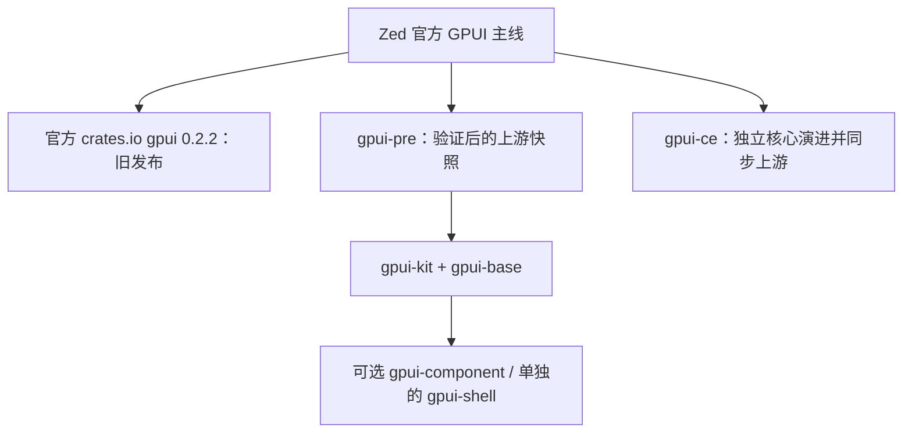

# GPUI 三条路线对比与 gpui-rhai 迁移选型

调研日期：2026-09-24。gpui-rhai 基线：`120ef223` / 0.1.5，当前依赖 GPUI 0.2.2、Rhai 1.26.0。
本报告**不把迁移工作量、学习成本或改动规模列入评分**，只比较最终能力、行为完整性、质量证据及后续可持续获得的能力。

**现行范围与建议：** 用户已明确内置 3D 可以交给有需要的 Rust Host／扩展作者。将“升级上游 GPUI 核心”和“采用 Kit/Base 应用行为”拆开后，当前优先建议直接通过 gpui-pre 获取较新的官方上游快照；官方完整 crate 家族恢复及时发布并通过验收后再切回。Kit/Base 按具体模块收益另行选择。详见 [上游核心与 Kit 收益拆分](upstream-core-vs-kit.zh-CN.md)。下文保留不同目标下的技术比较，此前以 3D 为一等内置目标的 CE 倾向不再代表现行范围。

## 1. 决策

**建议升级离开旧 GPUI 0.2.2 基线；当前可直接依赖 gpui-pre 家族，不以引入 Kit/Base 为前提。**

gpui-rhai 已经拥有 Rhai 表达层、source-owned 组件、主题／样式、事务、生命周期、数据和图表模型。我们需要的新核心能力不依赖 Kit 的控件层。是否替换某项输入／富文本／焦点等实现，按其独立收益和状态所有权决定。

Kit 对希望取得完整应用基础设施的终端应用很有价值；CE 对需要核心 shader／GPU 扩展的项目很有价值。这些比较仍成立，但不应把可选能力自动变成我们必须依赖的层。

本次“直接 pre”建议是技术层级选择，不是迁移工作量判断。迁移仍需完整行为验收；实际独立编译 probe、工具链条件和将来回官方 crate 的条件，详见最新补充。

## 2. 先厘清：官方发布慢、官方源码开发、社区分叉是三件事

### 官方 crate 确实滞后

查询 crates.io：`gpui` 最新稳定版本仍是 **0.2.2，发布于 2025-10-22**。我们使用的正是这个版本。[crates.io 原始版本数据](https://crates.io/api/v1/crates/gpui)

### Zed 并没有停止 GPUI 源码开发

查询官方主仓库自 2026-09-01 起、路径限定为 `crates/gpui` 的提交，返回 **47 条，无后续分页**；这不是整个 GPUI crate 家族的总数，也不是 47 个新功能，包含修复、文档和依赖变更。

近期已进入官方主线的代表工作：

| 日期 | 官方变更 | 对我们的意义 |
|---|---|---|
| 09-07 | [TestWindow scale-factor simulation](https://github.com/zed-industries/zed/commit/b95b188b59454bc2b01f08a54ab0182c4a55f141) | 更好测试缩放、DPI 与命中／布局一致性 |
| 09-12 | Window 可见性接口、frame-driven renderer session | 隐藏窗口资源管理、帧调度与嵌入 |
| 09-12 | Web Canvas 字体 fallback | Web 中缺字及文本呈现 |
| 09-14 | 动态字体安装和 ShapedLineCursor | 字体管理、编辑器／文本命中基础 |
| 09-16 | Web task queue 避免主线程等待，窗口可见性与 journal | 响应与调度诊断 |
| 09-20 | macOS 关闭窗口时释放 accessibility adapter | 平台语义资源生命周期 |
| 09-23 | wrapped-line 越界命中 panic 修复 | 文本交互正确性 |
| 09-24 | macOS 松开按钮后停止 synthetic drag | 原生拖动生命周期 |

所有精确 SHA、时间和原始链接保存在 [core 提交清单](evidence/zed-gpui-september.json) 与 [macOS 清单](evidence/zed-gpui-macos-september.json)。例如 [09-23 的文本命中修复](https://github.com/zed-industries/zed/pull/64672)、[09-20 的 AX 释放修复](https://github.com/zed-industries/zed/pull/64143)。

因此，“官方不更新”的准确表述是：**独立 crates.io 发布节奏落后于活跃的源码主线**。Zed 编辑器的版本号、GPUI Cargo manifest 的版本号、源码能力和独立 crate 的发布时间不能混为一谈。

### gpui-kit 不是同性质的核心分叉

Kit 的维护规则明确要求 gpui-pre 是版本对齐的上游快照，不携带下游行为补丁。精确 commit 的政策进一步说明：每周检查上游，发布前构建／测试 Kit 并报告结果，但快照无论该验证结果如何都会发布；Kit 自身通过精确版本 pin 选择快照，升级 pin 时同时适配上游变化。此前“兼容失败就不发布快照”的描述已在本次复核中更正。[维护政策](https://github.com/longbridge/gpui-kit/blob/477a8d90bb318cfbf0bbdc0f29517d437ad003e1/CONTRIBUTING.md)

gpui-ce 则独立修改 GPUI 核心，同时同步上游。它不仅解决打包问题，也在改变核心渲染和 API。



## 3. 比较基线：发布版本和主线分别看

| 路线 | 已发布版本 | 本轮核对的源码 |
|---|---|---|
| 官方 crates.io GPUI | 0.2.2，2025-10-22 | 我们现有依赖 |
| Zed 官方主线 | 不等于上述旧 crate | `6fae7f351370811131fe0f614a14125f84819415`，2026-09-24 |
| GPUI Kit | **0.6.6，2026-09-21** | release `9765ae2c9a5e…`；另查 main `477a8d90bb31…` |
| Kit 底层 gpui-pre | **0.3.6，2026-09-21** | 包内 metadata 指向 Zed `bcf6582ce3500df93a8a39366640173e6786cea6`，09-21 |
| GPUI CE 稳定 crate | **gpui-ce 0.2.2，2026-08-28** | 实际下载并检查发布包 |
| GPUI CE 主线 | 独立于稳定 crate | `c39bf5abfa81e3851367be0830c6caf7360f6af3`，2026-09-23 |

Kit 0.6.6 明确把底层 gpui-pre/platform/web 固定到 `=0.3.6`。[发布说明](https://github.com/longbridge/gpui-kit/releases/tag/v0.6.6)、[依赖记录](https://crates.io/api/v1/crates/gpui-kit/0.6.6/dependencies)。因此它尚不包含 09-23/24 刚进入官方的修复，后续应按经过验证的精确快照选择候选。

CE 的相同版本号 `0.2.2` **不代表它等于官方旧 0.2.2**：其发布包已具有新的公开无障碍 API。不过，9 月的 custom GPU、样式等独立扩展应按 CE 主线评估，不能当作 8 月稳定包已经全部提供。CE 的 alpha 发布文档说明仓库版本仍保持 0.2.2，发布时可生成 `1.0.0-alpha.N`；本轮 crates.io 查询只看到稳定 0.2.2 和两个旧 yanked 版本，没有据此虚构一个已发布 alpha。[CE 发布规则](https://github.com/gpui-ce/gpui-ce/blob/c39bf5abfa81e3851367be0830c6caf7360f6af3/docs/releasing.md)

CE 同步状态记录的完整上游基线是 09-03；之后存在独立修改和挑选修复，不能直接说所有能力都落后 21 天。原始来源见 [baselines](evidence/baselines.json)、[版本记录](evidence/versions.json)。

## 4. 按迁移效果比较

| 维度 | 官方最新主线 | gpui-ce 当前主线 | gpui-kit 0.6.6 路线 | 对 gpui-rhai 的判断 |
|---|---|---|---|---|
| 系统无障碍接入 | 新公开语义与 action API | 同类 API，并有额外 aria helper | 新底层 API＋Base 组件语义／交互支持 | 三者都明显优于旧 0.2.2；Kit 更适合整套控件落地 |
| 输入／复杂文本 | 强底层，应用自行组织 | 底层＋发展中的独立元素 | Input/Textarea/Editor/富文本、选择、历史、触控等基础层 | Kit 的现成行为完整性优势最大 |
| 焦点、弹窗、选择组件 | 框架原语 | 框架原语及扩展 | 无样式 Base 行为与测试体系 | Kit 更贴近我们大量复杂控件需求 |
| 主题与 Omarchy 风格 | 应用负责 | 样式表达更丰富 | Base 可独立于 Component 展示使用 | 都能保留我们的 token；外观不会因更换依赖自动改善 |
| 系统 Reduce Motion | App flag／动画支持，需平台读取桥接 | 类似，并扩展 style transitions | Base 已接入平台偏好读取 | Kit 有直接收益，但实时跟随范围需注意 |
| Web | 上游已有 Web 能力 | 主线保留 Web 并有定制 GPU 支持 | facade、字体／资产与真实 Web Gallery 路线 | Kit 的应用整合证据更完整；CE 不是“没有 Web” |
| iOS/Android | 平台抽象，应用需集成 | 本轮未找到同等完整的应用接入层 | 0.6.2 起提供外部移动 Platform 接入及触控控件能力 | Kit 路线更明确；不等于拿桌面程序直接获得完整移动产品 |
| 核心图形／shader 扩展 | 以上游 API 为边界 | **更强**：共享渲染契约、WGSL、custom GPU、渐变边框／阴影等 | 跟随上游底层，Base 侧提升应用行为 | CE 在自定义图形引擎方向胜出 |
| RTL／混向文本隔离 | 新能力需逐项确认 | 新能力需逐项确认 | Base 行为不等于原生 bidi 隔离完整 | 本轮没有足够证据判定某条路线已完全关闭该缺口 |
| 端到端速度 | 未做本项目 A/B | 未做本项目 A/B | 未做本项目 A/B | 不给任何一方虚构性能冠军 |
| 获取上游修复 | 最直接 | 需要同步并处理独立改动 | 通过快照对齐上游，再验证 Kit | 当前 Kit 快照更接近最新上游，CE 有自己的独立价值 |

这里的排名依据我们实际要交付的效果：可访问的桌面组件、输入正确性、状态一致、主题可配置、跨平台可扩展。迁移工作量没有进入判断。

## 5. 最重要的收益：把我们的语义树真正接到系统

我们现在的 [accessibility.md](../../accessibility.md#pinned-gpui-limitation) 正确描述了 GPUI 0.2.2 的限制：有内部 AccessibilityTree，但没有公开、完整的元素角色／标签／值写入 API。

我分别检查了旧 0.2.2、CE 发布包、CE 主线、gpui-pre 0.3.6 和官方主线的 `StatefulInteractiveElement`：

- 新底层提供 `role`、`aria_label`、description、selected/toggled、numeric value、row/column 等接口。
- 新 GPUI 提供 `Element::write_a11y_info`、synthetic children、窗口无障碍 action 接入。
- CE 主线另加 aria_disabled/modal/live/hidden 等便捷接口。
- Kit 当前底层缺少其中部分便捷方法，不等于不能写对应 AccessKit 信息；应沿公开 Element 写入接口核对，而非只数 fluent 方法。

证据：[API 扫描矩阵](evidence/accessibility-api-matrix.json)、[官方 div 源码](https://github.com/zed-industries/zed/blob/bcf6582ce3500df93a8a39366640173e6786cea6/crates/gpui/src/elements/div.rs)、[官方 Element 接口](https://github.com/zed-industries/zed/blob/bcf6582ce3500df93a8a39366640173e6786cea6/crates/gpui/src/element.rs)、[CE div 源码](https://github.com/gpui-ce/gpui-ce/blob/c39bf5abfa81e3851367be0830c6caf7360f6af3/crates/gpui/src/elements/div.rs)。

这是应该离开旧依赖基线的强理由，不是单纯追版本号。迁移应把我们已保留的 role/name/value/relations、稳定 ID、presented geometry、虚拟列表可见范围与 action 分派接入平台。**换 Cargo 依赖不会自动完成这座桥。**

完成后的用户效果应包括：VoiceOver/UIA/AT-SPI 能识别和操作实际控件；虚拟行和图表语义随呈现帧更新；Dialog 焦点边界在平台树中一致；关闭 View 后不残留 action 或语义资源。

本轮没有做三平台辅助技术实机签收，因此这部分是“已具备实现条件与明确收益”，不是“已经替我们完成迁移后的认证”。

## 6. Kit 的收益来自应用基础层，而不只是更多控件外观

当前 [Kit release](https://github.com/longbridge/gpui-kit/releases/tag/v0.6.2) 和下载源码可以确认以下基础：

- Base 的输入、富文本、历史、selection、焦点、弹窗和虚拟化基础可独立于 styled Component 使用。
- 移动集成保留 `Application::with_platform` 入口，支持触控选择、滚动回弹等应用行为；调用方仍需提供原生宿主。
- 系统 Reduce Motion 读取进入 App flag；Base 的 motion primitives 会消费该值。
- 提供原生测试、观察与几何测量工具；同一底层家族支持 Web。

一个需要明确的边界：`gpui-base 0.6.6/src/reduce_motion.rs` 中，Linux 通过 portal 监听变化；macOS/Windows 初始化时读取，运行中变更需要重新调用读取入口，不能宣传为三个平台均自动实时跟随。我们的 Host MotionPreference 与作用域政策仍应是最终权威。

Kit 不会替代我们既有的 Rhai 事务、安全边界和 source-owned 设计。尤其不能直接引入第二套全局 Theme／selected state／animation authority，让 Runtime 与 Base 争夺同一个事实。

推荐的分层结果：

```text
应用 Rhai / copied components / semantic tokens
                  ↓
gpui-rhai：受控状态、事务、生命周期、身份、权限、数据与图表契约
                  ↓
适配后的 gpui-base 行为能力＋我们必须自有的原生行为
                  ↓
gpui-kit 对齐的上游 GPUI 快照与平台后端
```

输入、富文本等基础行为可以主动采用更完整的 Base 能力，不必为了维持旧实现而错过迁移效果；但文件／链接／远程图片／剪贴板等权限仍要经过我们的 Host 边界。`gpui-shell` 会引入另一套语言与 Runtime，是另外的产品选择，不是本次底层升级所必需。

## 7. CE 的强项是真实的，但要看能力在哪个平台、哪个版本上

CE 9 月已合并的核心变化包括：

- [WGPU/WGSL 迁移 #215](https://github.com/gpui-ce/gpui-ce/pull/215)：共享 shader／渲染契约及相关重构。
- [Custom GPU API #237](https://github.com/gpui-ce/gpui-ce/pull/237)：复用设备和 queue、离屏 target、合成以及 device-loss 后重建。
- style transitions、corner smoothing、可配置虚线、边框／阴影渐变。
- 更开放的 hit-test、drag、asset registry 与补充 aria API。

这些并非仅是 crate 重命名。如果我们要做大量定制 GPU 可视化、特别的 shader 效果或框架级图形扩展，CE 会更有吸引力。

但两点不能误判：

1. **统一 WGSL 不等于所有平台已使用同一 WGPU renderer。** #215 明确保留平台 renderer 作为默认路径，macOS 源码仍选择 `gpui_apple::metal_renderer`。
2. **当前 typed custom GPU 入口不是全平台等价。** `WgpuContextHandle::from_window` 和示例的 cfg 指向 Linux/FreeBSD，以及启用对应能力的 WASM；没有相同的 macOS/Windows 入口。Windows 的旧 type-erased context 接口另属一条路径，不能拿来证明 typed API 已完全一致。

源码：[WgpuContextHandle](https://github.com/gpui-ce/gpui-ce/blob/c39bf5abfa81e3851367be0830c6caf7360f6af3/crates/gpui_wgpu/src/wgpu_context.rs)、[custom GPU 示例](https://github.com/gpui-ce/gpui-ce/blob/c39bf5abfa81e3851367be0830c6caf7360f6af3/crates/gpui_wgpu/examples/custom_gpu.rs)、[macOS renderer 选择](https://github.com/gpui-ce/gpui-ce/blob/c39bf5abfa81e3851367be0830c6caf7360f6af3/crates/gpui_macos/src/gpui_macos.rs)。

这对我们以 macOS 为当前主要验收环境的项目很重要。CE 的扩展潜力不能直接换算成我们当前 100k Chart、表格或文本路径的实际加速。图表的大量开销还在数据变换、布局与场景构建，更换最终 GPU 后端不会自动消除它们。

CE 更丰富的 shader 样式也不是我们当前 Omarchy 风格的主要瓶颈。token 一致性、排版、焦点、选中态和几何正确性，仍由我们自己的组件契约决定。

## 8. 维护与 CI：看实际证据，不用星数或口碑替代

本轮只使用仓库、crates.io、源码和 Actions 等一手材料，不以社区争论、AI 标签或传闻判断质量。

核对到的 CI 状态：

- Kit 0.6.6 release commit 的 macOS/Linux/Windows Test jobs 均成功，发布任务成功；但整体 CI 因 **Recipes / Verify executable application recipes** 失败。不能写成“所有 CI 全绿”，也不能把它说成三平台核心测试失败。
- CE 最新 head 的 CI 为成功，但改动为 CI 配置，平台 tests 被跳过；最近的 09-21 代码提交中 macOS/Linux/Windows tests 成功，整体失败来自 taplo formatting，随后移除了过时步骤。不能把 skipped 当作最新 commit 已完整实测，也不能据 formatting 失败否定运行时。

原始归纳：[CI 观察记录](evidence/ci-observations.json)、[Kit 对应 run](https://github.com/longbridge/gpui-kit/actions/runs/35604997533)、[CE 代码 run](https://github.com/gpui-ce/gpui-ce/actions/runs/35549033714)。本轮没有获取 Recipes 失败的完整日志，不推测它的具体根因。

Kit 的优势在于上游快照与应用基础层一同验证、版本家族明确；CE 的优势在于可以独立推进核心能力和合并框架需求。前者更符合我们此阶段的完整应用 Runtime，后者适合核心图形能力成为主要竞争力的项目。

这不是以维护工作量排斥 CE；衡量的是用户未来获得修复、新能力和一致行为的证据。两个项目都活跃，不能把 CE 简化为无人维护的实验分支。

## 9. 通用 UI 目标下，Kit 的优势为何成立

将工作量全部置零、只比较通用 UI 目标时，以下事实支持 Kit：

1. 我们最显著的提升是平台无障碍、输入与复杂交互完整性，Kit 对这些有更完整的现成基础。
2. Kit 底层仍吸收活跃的官方 GPUI 源码，因此选择它不是放弃 Zed 的持续修复。
3. CE 独有的核心渲染能力与当前产品重心的重合度较低，并存在明确的平台覆盖边界。
4. 我们已有复杂 Chart/Motion/事务模型。新增另一套动画／状态实现是否提高效果，应按实际模型统一程度判断，而非按新增 API 数量判断。
5. 没有 CE 与 Kit 在我们的 workload 上的可比性能结果，不能用“底层改得更多”推导“更快”。

通用终端应用缺少控件基础层时，Kit 的路线更完整。gpui-rhai 本身已有 Runtime／组件体系，且用户已明确 3D 可由 Host 实现，因此现行建议是直接升级上游核心，Kit/Base 作为可选能力层，CE 作为独立核心扩展的技术参照。

“CE 核心＋自行适配 Kit Base 的全部能力”理论上也是方案，但那是我们维护一个新的组合发行版；在没有该组合的行为验证之前，不能把假设中的两边全部优点计入现成 CE 的效果。这与迁移人力多少无关。

## 10. 什么才算迁移效果得到兑现

迁移应按以下结果验收，而不是以能编译作为完成：

| 验收域 | 必须证明的结果 |
|---|---|
| 原生无障碍 | 我们的稳定语义 ID、role/name/value、表格／虚拟行／图表、Dialog 关系进入平台树；系统 action 能返回正确受控事件 |
| 中文与复杂文本 | IME marked text、组合输入、复制粘贴、选区、换行、CJK fallback；升级不丢掉现有原生编辑能力 |
| 生命周期 | suspend/resume/dispose、窗口隐藏／关闭、后台候选和事件 generation 的原有性质保持 |
| Frame 一致性 | paint/hit/AX/viewport/export 使用一致版本；新后端不绕过我们的呈现提交边界 |
| 主题与布局 | 多窗口／子树主题、Host token overrides、UI scale、RTL；不退回 Base 全局主题作为唯一权威 |
| 性能 | 同机同配置比较原基线与新后端的输入延迟、前台 p95、100k stream、虚拟化与长期资源；不只测 Rust 函数或调度完成 |
| 新平台 | Web／移动端按真实输入、字体、权限、资源加载、挂起和恢复验收；“可编译”不等于产品级等价 |

**现行建议：直接通过 gpui-pre 家族升级官方上游核心；官方发行恢复并满足能力／验证条件后再切换发行来源。** `gpui-kit 0.6.6 + gpui-pre 0.3.6` 仍是可复查的 Kit 路线对照，不是要求我们引入 Kit。所有候选均应纳入所需上游修复及我们的验收结果。

本轮仅完成选型研究，没有修改 Cargo.toml、实施迁移或对三套后端做本地 A/B。源码／API 存在与上游 CI 是事实；以上总体优选和效果预期是基于这些事实的工程判断。证据和精确版本见 [method](evidence/method.json)、[baselines](evidence/baselines.json)、[source digests](evidence/source-digests.json)。
