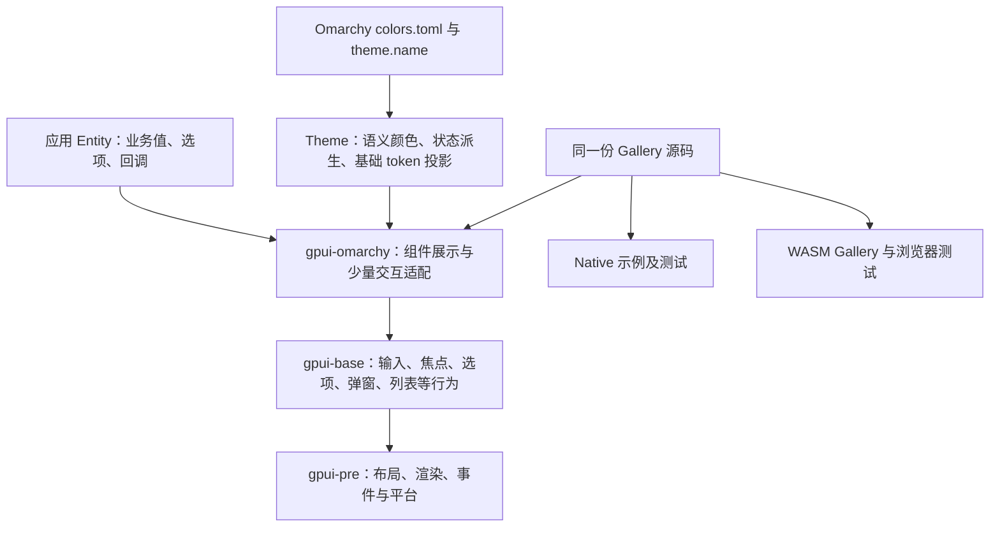

# gpui-omarchy 分析与 gpui-rhai 借鉴建议

日期：2026-09-24。

| 对象 | 本轮基线 |
|---|---|
| gpui-omarchy | `b186b959382494e2ea31fda94ac3677a82f55528`，main，crate 0.1.2 |
| 本地克隆 | `/Users/eddix/Codes/github.com/huacnlee/gpui-omarchy` |
| gpui-rhai | `120ef2239079ee5e2205c05a9b982768b096a19a`，已发布 0.1.5 |

## 1. 核心判断

**最值得借鉴的是它把一种视觉语言落实成“可缩放、可交互、可验证”的完整链路。建议吸收这些工程方法和部分设计规则，继续保留 gpui-rhai 的 Runtime 与主题架构。**

它并非另一套 Rhai Runtime，而是在 gpui-base 行为基础上构建的 Rust 展示库。源码相对短，是因为复用了输入、焦点、弹窗、虚拟列表等基础能力，不能据此推断它解决了我们所有的事务、脚本、生命周期和后台场景问题。

对我们最有价值的三件事：

1. **窗口级缩放与统一测量语义**：不仅放大文字，还同步更新原生控件、虚拟行、滚动条及像素接口的尺寸。
2. **把真实 Gallery 变成可重复验收工具**：同一套组件在多个主题／缩放下实际绘制，输入、状态、焦点和几何都有断言。
3. **集中定义交互状态视觉规则**：hover、focus、selected、pressed、disabled 形成明确关系，并测试组合与调用顺序。

若希望 gpui-rhai 应用真正跟随 Omarchy 桌面，**可选的 Host 系统主题桥接**是另一个高价值方向。浏览器中的同源 WASM Gallery 则适合长期规划，不值得仅为展示立即迁移 GPUI 后端。

## 2. 项目实际是什么

### 架构边界

[Cargo.toml](https://github.com/huacnlee/gpui-omarchy/blob/b186b959382494e2ea31fda94ac3677a82f55528/Cargo.toml) 固定 `gpui-kit=0.6.1`，关闭其 default features，开启 assets。实际依赖树包含 gpui-base 0.6.1、gpui-pre 0.3.1 和对应平台包；**没有启用 gpui-component 展示 facade**。Cargo.lock 含可选包记录、下载缓存里有该包，都不能代替实际依赖图判断。

源码有 31 个 Rust 文件，约 6,144 行，包含内联测试。Gallery 有 47 个组件预览＋1 个 overview。组件覆盖动作、表单、导航、覆盖层、数据／展示，包括 ColorPicker、OTP、Tree、Resizable、Dock、Markdown/HTML 等。

它的 Table 是可组合的 Table/Row/Head/Cell 展示原语，virtual list 是单独的构造器。不能把这些目录名直接等同于 gpui-rhai 已有的受控 Table、NativeCollection、复杂图表或流式数据契约。

### 与当前 gpui-rhai 的比较

| 维度 | gpui-omarchy | gpui-rhai 0.1.5 | 判断 |
|---|---|---|---|
| 表达层 | Rust 构造器与 base builder | source-owned Rhai 组件＋Rust Runtime | 借鉴分工，不引入第二套脚本／组件状态 |
| GPUI 家族 | gpui-kit/base 0.6.1、gpui-pre 0.3.1 | GPUI 0.2.2 | `App/Window/Entity` 等不是可直接互换的类型；不能 cargo add 后原样混用 |
| 主题作用域 | App 全局 Theme，更新时 refresh 全部窗口 | App/Window/subtree preference、Host overrides、增量依赖 | 我们的作用域模型更适合嵌入式多 View，应该保留 |
| 主题来源 | 原生 Omarchy 当前目录；语义或 ANSI TOML | Rhai ThemeVariant、15 个 bundled themes、Host 层 | 值得增加可选数据源适配，不把外部文件权限给 Rhai |
| 尺寸策略 | rem 为主，像素接口按 window.rem_size 解析 | 已支持 Length::Rems、spacing/radius/typography token | 我们缺少的是全链路缩放验收，不能说完全没有 rem |
| 圆角与密度 | 强主张的方形展示；许多数值直接写在 rem 调用中 | 多层可覆盖语义 token＋组件样式 | 不能把它的固定展示值替代我们的 token 体系 |
| 在线展示 | 相同 Rust Gallery 编译为 WASM | 当前重点是原生 Runtime/Gallery | 同源思想可立即借鉴，Web 后端需要独立成本评估 |

本轮按当前发布代码对照。此前的自定义 namespace 快照、Tabs spacing/字体适配、tabs.foreground 对比保护，以及 Chart label typography 已进入 0.1.5；**这些不是本报告新提出的待修复项**。

## 3. 最高价值：缩放是一个贯穿测量、缓存与渲染的契约

### 对方做得好的地方

Gallery 的 `set_zoom` 以启动时的 base rem 为基准，设置当前窗口 rem size；范围 50%–200%，并提供鼠标按钮和 Cmd/Ctrl 快捷键。切换组件或主题不会重建整个应用状态。它还主动触发 navigation list 的 remeasure。

关键不只是 `.text_size(rems(...))`：

- Scrollbar 宽度、thumb inset 等只接受 Pixels 的 API，用当前窗口 rem size 转换。
- Resizable panel 的尺寸与限制同样按当前窗口计算。
- Rich text 的 heading base font size 通过 window 解析。
- Gallery 的虚拟行 size vector 在 rem 改变时重建；测试断言相邻行连续且行高精确变化。
- 全组件循环在两个主题、rem=16/20/24 下执行真实 draw；另有缩放快捷键不破坏输入文字的测试。

源码：[Gallery zoom 与测试](https://github.com/huacnlee/gpui-omarchy/blob/b186b959382494e2ea31fda94ac3677a82f55528/examples/gallery/app.rs)、[list.rs](https://github.com/huacnlee/gpui-omarchy/blob/b186b959382494e2ea31fda94ac3677a82f55528/src/list.rs)、[text.rs](https://github.com/huacnlee/gpui-omarchy/blob/b186b959382494e2ea31fda94ac3677a82f55528/src/text.rs)。

### 我们应如何吸收

**保留 semantic token，再统一解析上下文。** rem 是单位，spacing.sm 是语义；两者不是替代关系。建议将窗口 UI 缩放、主题 typography/density 代际与实际测量环境纳入统一上下文，提供给普通节点、native primitives、虚拟化、文档和 Chart。后台工作只接收已解析的 owned 值。

当前普通 renderer 会将 `Length::Rems` 交给 GPUI；Chart 原生／场景／导出的部分 helper 则将 rem 按固定 16 换算。这个差异说明：在承诺任意窗口 UI 缩放之前，必须定义同一个单位转换入口及导出策略。这里是源码确认的适配点，不是声称本轮已复现了一个正常 100% 界面故障。

参考我们当前的 [renderer.rs](../../../crates/gpui-rhai/src/renderer.rs)、[Chart scene](../../../crates/gpui-rhai/src/chart/scene.rs)、[Chart export](../../../crates/gpui-rhai/src/chart/export.rs)。

需要分清三种变化：

| 变化 | 需要同步的内容 |
|---|---|
| 操作系统显示 DPI | 渲染栅格和平台坐标，不能当作用户密度设置 |
| 用户 UI zoom | 与阅读、操作相关的逻辑尺寸及测量缓存 |
| theme/font/density preference | 对应 token 及文本／布局依赖 |

不必把所有 px 自动改成 rem。边框、图标固有坐标、明确的最小目标、业务图形坐标有自己的含义；应声明哪些随 UI zoom，哪些保持逻辑像素策略。`border_1()` 也不应被误称为在所有 DPI 下都只占一个物理像素。

**完成条件：** 在同一个窗口内 100→125→150→200→100%，输入文字、选中项、滚动位置、Chart controlled viewport 和焦点保持；虚拟行不重叠、不留假空白；弹窗定位与命中随尺寸变化；重复设置相同 scale 不制造工作；导出 size/font 的含义有明确契约。

## 4. 高价值：统一状态视觉规则，并测试组合关系

### 可借鉴的实现

[Theme](https://github.com/huacnlee/gpui-omarchy/blob/b186b959382494e2ea31fda94ac3677a82f55528/src/theme.rs) 集中提供 normal/hover/selected/pressed fill、control/focus border 和 divider；控件消费这些状态函数。大部分填充从当前 foreground 派生，因此换色板时仍有共同的层级。

更有价值的是 [Button wrapper](https://github.com/huacnlee/gpui-omarchy/blob/b186b959382494e2ea31fda94ac3677a82f55528/src/button.rs)：先保存 hover/active/focus-visible refinements，最终 render 时根据 disabled 决定是否应用，激活和焦点行为继续委托给 base。测试同时覆盖“先 disabled 后 styles”和反向顺序，并通过实际指针输入验证禁用、恢复启用后的结果。Link 采用类似做法。

[button_group.rs](https://github.com/huacnlee/gpui-omarchy/blob/b186b959382494e2ea31fda94ac3677a82f55528/src/button_group.rs) 还把 cursor 与 selected 分开：方向键移动 cursor，Enter/Space 才确认，每组一个 Tab stop。这个状态分离值得借鉴；具体键盘激活模式应按我们既定组件契约选择，不应全部照搬。

### 对 gpui-rhai 的适配

- 将共享状态配色／边框规则收敛到少量可主题覆盖的视觉规则，放在现有 token 派生和 Rhai 样式构造体系中。
- 保持 selected、focused、hovered、pressed、disabled 是不同事实；有优先级，但不能丢掉仍需呈现的选中语义。
- 复用 Runtime 已有输入、焦点和事件抑制，不因为参考项目有 wrapper 就再造一套 Rust 控件 Runtime。
- 增加禁用前后、主题切换前后、样式覆盖顺序、重复赋值的关系测试。我们原生 pseudo 路径以 paint 属性为主，不应直接照抄对方用 hover width 作探针的 API；应观察实际支持的颜色、边框、透明度与激活行为。

**不建议复制它的精确 alpha 数字。** 4%/8%/18%/22% 是其皮肤选择；我们已有 `table.selection` 的不透明合成规则和 15 主题对比测试。应对实际背景合成后的颜色验证，避免重新引入虚拟层混色差异。

也不建议照搬 Primary 按钮外观：对方当前 Primary 是透明底＋accent 轮廓，不是填充按钮；这是它的应用级决策。我们已经确定的 Button/Badge 密度与行动层级不应因参考样例而被重写。

## 5. 高价值、可选接入：真正跟随 Omarchy 系统主题

### 可复用的可靠性设计

[system_theme.rs](https://github.com/huacnlee/gpui-omarchy/blob/b186b959382494e2ea31fda94ac3677a82f55528/src/system_theme.rs) 支持语义格式和 ANSI color0…15 格式；中性表面从同一 palette 派生，on_accent 在黑白中选取对比较高者，整个候选通过解析后才应用。

[watch.rs](https://github.com/huacnlee/gpui-omarchy/blob/b186b959382494e2ea31fda94ac3677a82f55528/src/system_theme/watch.rs) 的工程细节值得特别学习：

- 监视目录，覆盖原子保存和 symlink 替换。
- 同时处理 lexical 路径和 canonical 目标；Unix 记录 dev/inode，目录同路径重建后重新挂 watch。
- 容量 1 的通知队列合并 burst；OS callback 不阻塞。
- 文件系统访问事件不触发自激重读。
- 先挂 watch，再读初始值，减少启动窗口内的漏更新。
- 后续文件读取／解析放后台，前台仅在 theme 实际不同后应用。
- explicit apply 会停止 follow，follow 可以恢复；任务由对象持有，避免遗留无限后台循环。

这些路径有真实文件修改、symlink 替换、目录重建与 follow/explicit 切换测试，本轮均通过。

### 我们的正确落点

建议是**可选 Host adapter**，而非给 Rhai 文件系统权限，也不应让每个 ScriptView 各自扫描 HOME。文件 watcher、读取限制和错误处理留在 Host；解析为我们的 `ThemeVariant` 后，走已有主题事务／失效机制。

可使用的现有基础包括 `UiRuntimeState::replace_theme_variant_from_host` 和 `ThemeHandle::snapshot/observe`；后者是只读发布面，不要误当成 setter。watcher 到已挂载 View 的前台更新、唤醒、取消和作用域仍需明确设计。参考 [context.rs](../../../crates/gpui-rhai/src/context.rs)、[ThemeHandle](../../../crates/gpui-rhai/src/app.rs)。

适配时应保留我们的优势：

1. **来源与偏好分开。** Omarchy 文件更新是 palette source；OS light/dark、App/Window/subtree 选择是 preference，不要让一个 `system` 标志同时表示两种行为。
2. **Host overrides 最终生效。** 外部 colors.toml 不应覆盖用户已指定的字号、密度、圆角与 motion policy；没有 shell.toml 能力就明确只导入配色。
3. **首次失败和运行中失败不同。** 对方任意坏 palette 都回到 Tokyo Night。我们已有 last-good 语义，更适合首次读取失败用默认值、运行中坏候选保留当前主题并显示诊断，避免编辑文件时界面闪回默认。
4. **保持作用域。** 不复制 `Global<Theme> + refresh_windows()` 作为唯一模型；只更新受影响的窗口／组件。
5. **生产主题跟随与开发源码热重载分开。** 我们 dev-reload 的 PollWatcher 有不同用途。可以借鉴有界通知和 symlink 测试，但不因两者都叫 watcher 就合并生命周期或直接替换整个实现。

这项尤其适合“应用实际运行在 Omarchy 桌面”的需求；对当前主要在 macOS 使用的场景，它是可选集成，不应抢占基本 UI 一致性工作的优先级。

## 6. 最容易马上获益：把 Gallery 做成状态与缩放的验收面

对方的 Gallery 不仅摆外观，还具备状态、回调、焦点、文本、弹窗、列表和缩放交互。74 项测试中有 **25 项直接测试 Gallery**，包括输入 reset、Dialog/Sheet 关闭后焦点恢复、toast timeout 暂停／替换、列表跳转与滚动条拖动、切页保留状态。

值得移植的是测试结构：

- 一个 story 同时供真实 Gallery 和 native test 使用，避免“示例已变、测试仍测另一份简化 fixture”。
- theme × scale × representative state 循环保证每个组件实际 draw。
- 对高风险部件补语义／几何终点：仅“不 panic”或“截图变化了”不能证明选中值、焦点、滚动目标正确。
- 独立验证相同主题／缩放重复应用的幂等性，以及切换后状态不重置。

我们已有真实 Component Gallery、Theme Studio、独立原生测试和性能框架，不需要从头建立 Storybook 式系统。建议先补 Gallery 的 UI scale 控件和一份共享 story inventory，再把最近增加的 token overrides 测试扩展到所有关键组件族。

对方的全组件 rem 测试实际覆盖 100%/125%/150%，虽然 UI 控件支持到 200%，不能据此说其全部组件已经测过 200%。我们可直接把边界比例纳入矩阵。

此外，不建议模仿其 4,521 行单一 `examples/gallery/app.rs` 的组织方式。学习同源运行和测试，保留我们按场景／组件族拆分的可维护结构。

## 7. 中长期价值：同源 Web Gallery 和资产完成信号

[WASM 入口](https://github.com/huacnlee/gpui-omarchy/blob/b186b959382494e2ea31fda94ac3677a82f55528/examples/gallery-wasm/src/lib.rs) 直接通过 `#[path]` 复用 desktop Gallery 的 Rust 源文件。网站展示的是实际 GPUI 应用，不是重画一套 HTML 样机。Web 使用自己的字体与时间来源，主题切换更新同一个 app instance。

最新提交的 [资产加载器](https://github.com/huacnlee/gpui-omarchy/blob/b186b959382494e2ea31fda94ac3677a82f55528/examples/gallery-wasm/src/assets.rs) 在图标下载完成后发出 `gpui:asset-loaded`，再调用 refresh；包含 cache 和 pending 去重。这体现了很好的完成边界：**资源下载成功后还必须安排一次实际呈现，不能靠用户下一次操作碰巧刷新。** 与我们此前 prepared/presented 的区分是相通的工程原则。

[网站测试](https://github.com/huacnlee/gpui-omarchy/blob/b186b959382494e2ea31fda94ac3677a82f55528/website/tests/website.spec.ts) 检查实际 canvas 不空、主题改动反映到 Rust 画面及 app 未重建，并测试 Select/Combobox 交互。本轮只审阅这些浏览器测试，未运行 WASM/Playwright。

我们现在可以吸收“真实组件就是文档示例”和“完成后显式刷新”的原则。直接移植 Web Gallery 则需要 gpui-pre/web 或其他后端路线，属于架构决策；不能为了在线演示把两个 GPUI 家族混进当前 Runtime。

## 8. 不能直接照搬的部分

| 对方设计／现状 | 对我们的处理 |
|---|---|
| 大量 literal rem、`.rounded_none()`，apply 时把所有 base radii 清零 | 可缩放不等于可换密度／圆角。继续使用现有 spacing/radius token 和组件 parts |
| 单个 App Global Theme | 保留我们的多窗口／子树主题及增量失效 |
| Primary 轮廓、selected 独占填充；avatar 默认方形 | 是视觉语言选择，不覆盖我们已有 Button/Badge/Tag/Tabs 规格 |
| OptionGroup 用 index，方向键 cursor、Enter 确认 | 保留我们 stable key 与既定受控协议；动态重排时必须单独验证身份 |
| 系统坏文件立刻回默认 palette | 适配为首次 fallback＋运行中 last-good，区别明确 |
| .SystemUIFont；Web Inter | 它也没有强制等宽。我们仍由 Host 注册字体／CJK fallback，不为“复古”硬塞字体 |
| docs/design.md 仍写 0.6.0、缩放待实现等旧段落 | 以 Cargo.lock、实际源码和执行结果为准；我们的维护规格避免累计互相矛盾的阶段笔记 |
| 测试丰富，但本轮没有生产性能基线与完整实机审查 | 不宣称其性能更好或所有平台可直接出货 |

本项目 LICENSE 是 MIT。若后续复制实现，保留相应声明；引用依赖、字体或图标时按各自来源处理。本次只克隆完整上游仓库，没有把它的源码、截图、头像、字体或图标复制进 gpui-rhai。

## 9. 建议落地顺序

| 顺序 | 工作包 | 主要收益 | 验收重点 |
|---|---|---|---|
| 1 | Gallery UI scale＋共享主题/尺寸测试矩阵 | 最快暴露实际缩放与缓存缺口 | 关键组件 75/100/125/150/200%，同一 app 保留输入与状态 |
| 2 | 统一测量上下文与缓存失效 | 原生／虚拟行／Chart／export 单位一致 | 连续缩放、切回、两窗口不同 scale、同值幂等、命中与几何一致 |
| 3 | 控件状态视觉规则与关系测试 | hover/focus/selected/disabled 风格一致 | 禁用组合、覆盖顺序、15 主题实际背景对比、局部主题 |
| 4 | 可选 Omarchy theme source adapter | 与真实 Omarchy 桌面配色同步 | 原子保存、symlink／inode 替换、损坏恢复、跟随取消、Host overrides 优先 |
| 暂缓 | Web 后端／依赖家族迁移 | 在线真实交互展示 | 独立评估平台、ABI/API、打包、字体、辅助功能与 CI 成本 |

**如果只做一件事：先把 Gallery 的统一缩放旋钮和多主题／多尺寸状态测试补上，然后用它驱动测量链路整改。** 这最直接延续本项目最近的 UI 打磨工作，也能在新增组件时持续防止 token、字号、布局缓存再次失配。

## 10. 本轮验证与交付边界

- clone 成功，origin 为用户指定仓库，main 固定到上述 commit，克隆工作区无修改。
- `cargo fmt --all -- --check`：通过。
- `cargo test --locked --all-targets`：**74/74**，其中 lib 43、interaction 6、Gallery 25。
- `cargo test --locked --offline --doc`：命令成功，**0 个 doctest**，不据此宣称文档示例已全面验证。
- 初次 offline test 因本机没有 gpui-kit 缓存失败；联网取得依赖后完整测试成功。没有把缓存缺失当成产品问题。
- 依赖构建提示 `block 0.1.6` 的 future-incompatibility；当前测试通过，后续升级仍应跟踪，未将其认定为已发生的运行故障。
- 本轮未改上游产品、未改 gpui-rhai 产品；在 gpui-rhai 中仅新增本分析目录。没有运行原生 Gallery 的实机人工矩阵、WASM 浏览器套件或 latency benchmark，不把源码和 headless 测试等同于这些验证。

证据：[metadata](evidence/metadata.json)、[测试日志](evidence/test-online.log)、[实际依赖树](evidence/dependencies.log)、[component facade 检查](evidence/component-facade.log)、[fmt](evidence/fmt.log)、[doc-test](evidence/doc-test.log)。
